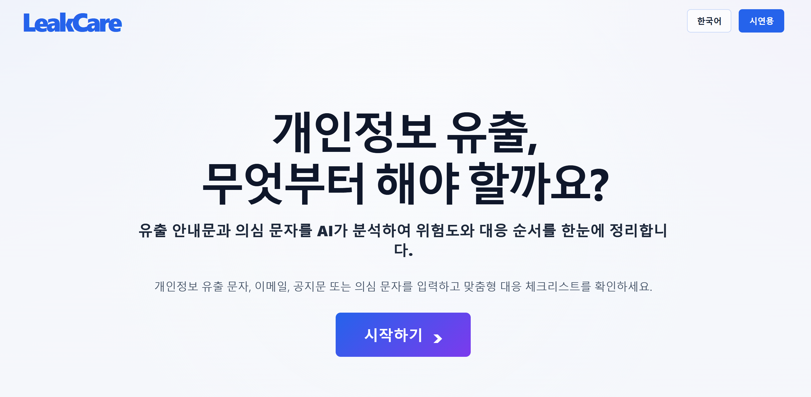
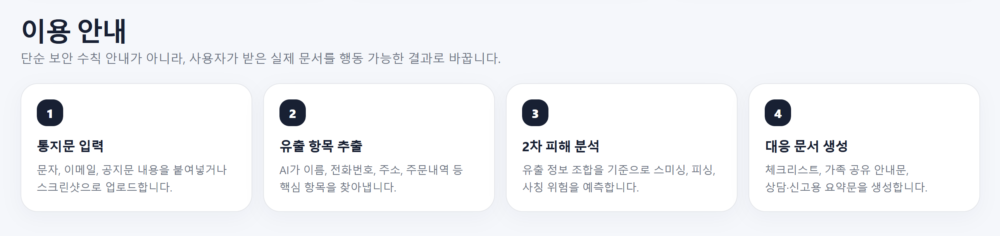
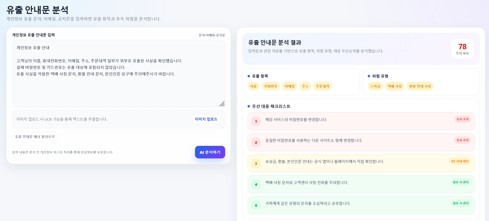
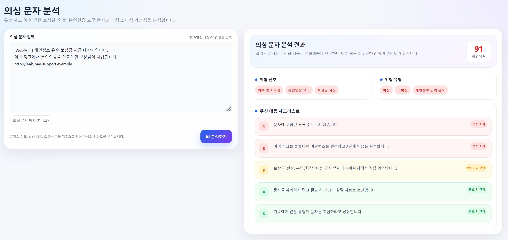
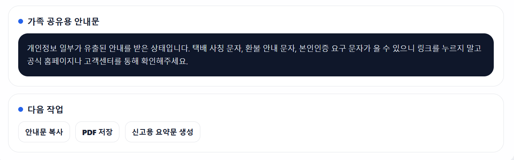

<div align="center">

<h1 style="font-size: 48px;">LeakCare</h1>

<h2>개인정보 유출 2차 피해 대응 AI 웹서비스</h2>

</div>

---

## Index

- [프로젝트 소개](#1-프로젝트-소개)
- [상세설계](#2-상세설계)
- [개발결과](#3-개발결과)
- [설치 및 사용 방법](#4-설치-및-사용-방법)
- [소개 및 시연 영상](#5-소개-및-시연-영상)
- [팀 소개](#6-팀-소개)
- [해커톤 참여 후기](#7-해커톤-참여-후기)
  
---

## 1. 프로젝트 소개
### 1.1. 개발배경 및 필요성

 최근 SK텔레콤이나 쿠팡 등에서 발생한 대규모 개인정보 유출 사고는 정보 노출 문제와 함께 택배 사칭, 보이스피싱 등 심각한 2차 피해를 낳는 사회적 문제로 대두되었다. 이러한 상황에서 사용자가 유출 사고 이후 가장 먼저 필요로 하는 것은 단순한 유출 사실 확인을 넘어 자신의 상황에 맞는 구체적인 대응 시나리오이다. 일반 사용자는 기업으로부터 유출 안내문을 받더라도 법적 표현이나 기술적 용어가 포함된 복잡한 내용 탓에 정확히 어떤 정보가 유출되었고 이것이 어떤 피해로 이어지는지 판단하기 어렵다. 또한 기존의 개인정보 포털 등은 유출 여부 조회나 일반적인 보안 수칙 안내에만 집중되어 있어, 사용자가 받은 유출 통지문을 직접 해석하고 개인별 대응 순서를 정리해 주는 실질적인 가이드는 부족한 상황이다.

### 1.2. 개발 목표 및 주요 내용

 본 프로젝트의 목표는 개인정보 유출 안내 문자, 이메일, 공지문을 받은 사용자가 복잡한 안내문을 직접 해석하지 않아도 자신의 상황을 빠르게 이해하고 필요한 조치를 선택할 수 있도록 돕는 AI 기반 웹서비스인 "LeakCare"를 개발하는 것이다. LeakCare는 사용자가 수신한 유출 통지문, 문자, 이메일을 AI로 분석하여 기업명을 추정하고, 관련 유출 사고 검색 및 유출 항목 확인을 거쳐 2차 피해 위험도를 분석한 뒤 최종적으로 대응 체크리스트를 생성하는 흐름으로 결과를 제공한다. 이를 통해 사용자는 자신이 받은 안내가 실제 유출 사고와 연관된 것인지 직관적으로 파악하는 동시에 비밀번호 변경, 2단계 인증 설정과 같은 기술적 조치부터 지인 사칭 예방을 위한 가족 공유까지 필수 행동 지침을 즉각적으로 이행할 수 있다.

### 1.3. 세부내용

 LeakCare는 사용자가 입력한 문자, 이메일, 공지문에서 AI가 기업명, 서비스명, 사고 키워드, 유출 항목을 추출하고, 검색 API를 활용하여 관련 기사 및 기업 공식 공지 등 외부 자료를 조회한다. 이후 입력 내용과 외부 자료를 종합적으로 분석하여 실제 유출 사고와의 관련성, 유출 정보의 종류, 예상되는 후속 위험을 판단한다. 분석 결과는 기업명, 유출 항목, 위험 유형, 판단 근거, 대응 체크리스트 등의 형태로 제공되어 사용자가 필요한 조치를 신속하게 수행할 수 있도록 지원한다.

 또한 본 서비스는 토목공학 분야의 시설물 유지관리 우선순위 결정 개념을 개인정보 유출 대응에 적용한다. 시설물의 위험도와 중요도를 평가하여 보수 우선순위를 결정하는 방식과 같이, 유출된 개인정보의 종류와 예상 피해 규모를 분석하여 대응 우선순위를 제시한다. 이를 통해 사용자는 가장 시급한 보안 조치부터 체계적으로 수행할 수 있으며, 개인정보 유출로 인한 2차 피해를 효과적으로 예방할 수 있다.

### 1.4. 기존 서비스 대비 차별

| 구분 | 기존 서비스 | LeakCare |
| --- | --- | --- |
| 분석대상 | 유출 여부 조회 | 일반 신고 중심(제공받는 정보의 한계) | 사용자가 실제 받은 문자, 메일, 공지문 |
| AI 활용 | 제한적 또는 없음 | 기업명 추출, 사고 검색, 위험도 분석.대응 생성 |
| 외부 정보 활용 | 사용자가 직접 검색 필요 | 검색 API로 관련 기사, 공지 자동 조회 |
| 결과 제공 방식 | 일반 보안 수칙 안내 | 개인별 위험도와 대응 체크리스트 제공 |
| 후속 위험 안내 | 사용자가 직접 판단 및 조치 | 스미싱, 피싱, 택배 사칭 등 위험 유형, 자동 분석 |
| 사용자 편의성 | 여러 기관, 사이트를 직접 확인해야 함 | 한 화면에서 사고 정보, 위험도,대응 방법 확인 |
| 확장 기능 | 신고, 조회 중심 | 가족 공유문, 신고용 요약문,의심 문자 분석 제공 |

LeakCare는 단순 조회·신고 중심의 기존 서비스와 달리 개인정보 유출 안내문의 해석부터 위험 분석, 맞춤형 대응 방안 제공까지 지원하는 AI 기반 통합 대응 서비스라는 점에서 차별성을 가진다.

### 1.5. 사회적가치 도입 계획

●  개인정보 유출에 따른 2차 범죄예방을 통한 사회적,경제적 피해 비용을 실질적 저감 가능하다. 사고 발생 직후 사용자가 즉각 행동할 수 있는 골든 타임 로드맵을 제공함으로써 피해구제에 투입되는 치안, 사법, 행정 비용을 저감 할 수 있다.

●  유출사고 이후 사회 전반에 확산되는 디지털 환경에 대한 불안감을 완화하고, 안심할 수 있는 디지털 상호작용 환경을 조성하여 사회적 신뢰 자본을 구축할 수 있다.

●  디지털 소외계층을 포용하는 정보 격차 해소를 실행할 수 있다. 복잡한 법적 문구와 보안 전문용어 대신 사용자에게 직관적인 언어로 재해석하여 사이버 위협에 능동적으로 대처할 수 있는 디지털 포용성을 실현가능하게 한다.

### 1.6 법적 보안적 책임 범위

#### 1.6.1 민사상 손해배상 책임 면제
 AI의 잘못된 분석으로 인해 사용자가 잘못된 조치를 취하거나 기업에 손해가 발생했다고 주장할 가능성이 있다. 이는 민법 제 750조에 따른 고의·과실로 인한 손해배상 책임 문제로 이어질 수 있다. 이에 대응하여 민법 제 105조에 규정된 당사자 간 합의 우선 원칙에 따라 유효한 약관 및 면책고지 시스템을 설계한다. 서비스 이용 전 팝업창과 안내문을 배치하여 "본 AI 분석 결과는 입력된 문자 메시지를 기반으로 한 추정치 및 참고용 정보이며, 실제 해당 기업의 공식 공지나 법적 확인 내용과 다를 수 있다"는 점을 명시한다. 이를 통해 서비스 제공자의 고의·과실 가능성을 방어하고 최종 판단 책임이 사용자에게 있음을 분명히 한다. 또한 AI가 제시하는 대응 시나리오 역시 법적 조언이 아닌 '권장 조치 사항'임을 인지시킨다. 

#### 1.6.2 웹사이트 자체의 2차 개인정보 유출 및 데이터 보안 책임
 사용자가 유출 문자를 복사하여 붙여넣는 과정에서 실명, 전화번호, 계좌번호 등 실제 개인정보가 웹사이트 서버로 유입된다. 이를 가림 처리 없이 외부로 전송할 경우, 개인정보 보호법 제17조(개인정보의 제공) 위반에 해당하여 서비스 운영자가 직접적인 법적 책임을 지게 되는 심각한 보안 리스크가 발생한다. 이에 대응하여 사용자가 문자를 입력하는 즉시 외부 API로 전송되기 전 웹사이트 서버 내부에서 마스킹 처리를 거치도록 한다. 식별 가능한 개인정보를 서버 단에서 완벽하게 제거한 후 정제된 텍스트만 외부로 송신하므로 '개인정보의 제3자 제공' 행위 자체가 성립하지 않도록 전제를 차단한다.

<br>


<br>

## 2. 상세설계
### 2.1. 시스템 구성도

<p align="center">
  
</p>

### 2.1. 사용 기술


| 구분 | 사용 기술 | 버전 |
|---|---|---|
| 프론트엔드 | HTML / CSS / JavaScript / React 또는 Next.js | React 19.2 또는 Next.js 16.2.6 |
| 백엔드 | Node.js / Next.js API Route 또는 Express | Node.js 24.15.0 LTS / Express 5.2.1 |
| AI 분석 | OpenAI API / Gemini API | - |
| 검색 API | 네이버 뉴스 검색 API / Google Programmable Search API | - |
| 데이터 저장 | Supabase JS / Firebase | Supabase JS v2 |
| 배포 | Vercel | - |
| 형상관리 | Git / GitHub | - |
| OCR 확장 | Tesseract.js / OCR API | Tesseract.js 7.0.0 |
| 문서 저장 | jsPDF | 4.x |
| AI 코딩 도구 | GitHub Copilot / Cursor / Claude / Gemini / openAI| - |
> 생성형 AI 및 AI 코딩 도구 활용 내용은 [3.4 AI 도구 활용](#34-ai-도구-활용) 참고

<br>


<br>

## 3. 개발결과
### 3.1. 전체시스템 흐름도

```text
[1] 사용자 입력
    → 개인정보 유출 문자, 이메일, 공지문 또는 의심 문자 입력
        ↓
[2] 프론트엔드 처리
    → 입력 내용을 백엔드 API로 전달
        ↓
[3] 개인정보 마스킹
    → 전화번호, 이메일, 주소 등 민감정보를 API 호출 전 자동 마스킹
        ↓
[4] AI 핵심 정보 추출
    → 기업명, 서비스명, 사고 키워드, 유출 항목 추출
        ↓
[5] 검색 API 연동
    → 기업명과 사고 키워드로 관련 기사, 공식 공지, 웹문서 검색
        ↓
[6] AI 종합 분석
    → 입력문과 외부 자료를 비교하여 사고 관련성, 위험도, 2차 피해 가능성 판단
        ↓
[7] 분석 결과 제공
    → 위험도, 유출 항목, 판단 근거, 대응 체크리스트, 가족 공유문, 신고용 요약문 제공
```

### 3.2. 기능설명
- 시작 페이지

  - 간단한 서비스 설명 제공
  - 서비스 이동 버튼 클릭 시 서비스 페이지로 이동
  

- 배너

  - 간단한 설명 배너와 이용 방식 설명
  - '이용 안내' 클릭 시 아래의 서비스 이용 설명으로 이동
  - '유출 안내문 분석하기' 클릭 시 유출 안내문 분석 페이지로 이동
  - '의심 문자 분석하기' 클릭 시 의심 문자 분석 페이지로 이동
   

- 이용 설명 페이지
  - 단계별 서비스 이용 안내 제공
  

- 유출 안내문 분석 페이지
  - 사용자가 개인정보 유출 문자, 이메일, 공지문을 입력하면 AI가 기업명, 서비스명, 사고 키워드, 유출 항목을 추출
  - 입력 내용은 분석 전 개인정보 마스킹 처리를 거치며, 검색 API를 통해 관련 기사, 공식 공지, 웹문서를 함께 확인
  - AI는 입력문과 검색 결과를 종합하여 사고 관련성, 위험도, 2차 피해 가능성을 분석
  - 분석 결과로 유출 항목, 위험 유형, 위험도, 우선순위별 대응 체크리스트를 제공
  


- 의심 문자 분석 페이지
  - 유출 사고 이후 받은 보상금, 환불, 본인인증 요구 문자 등 의심 문자 입력
  - AI는 링크 포함 여부, 요구 행동, 문장 패턴 등을 기준으로 피싱·스미싱·사칭 가능성 분석
  - 분석 결과로 위험 유형과 위험도, 사용자가 주의해야 할 행동 안내
  


- 결과 활용 기능
  - 분석 내용을 바탕으로 가족에게 전달할 수 있는 쉬운 공유용 안내문 생성
  - 기관 상담이나 신고 시 활용할 수 있는 요약문 생성
  - 생성된 안내문은 복사하거나 PDF로 저장할 수 있으며, 필요 시 입력 내용을 초기화 가능
 

### 3.3 디렉토리 구조

LeakCare는 Next.js 기반 웹서비스 구조로 설계하며, 화면 페이지, API Route, 외부 API 연동 로직, 개인정보 보호 유틸리티를 역할별로 분리한다.  
API 키와 민감정보는 GitHub에 업로드하지 않고 `.env.local` 및 배포 환경변수로 관리한다.

```text
LeakCare/
├── public/                    # 로고, 예시 이미지 등 정적 파일
│
├── docs/                      # 시스템 구성도, 발표자료, 시연 자료
│
├── src/
│   ├── app/                   # Next.js App Router 기반 페이지 및 API Route
│   │   ├── page.tsx           # 시작 페이지
│   │   ├── banner/            # 서비스 배너 및 이용 안내 페이지
│   │   ├── leak/              # 유출 안내문 분석 페이지
│   │   ├── sms/               # 의심 문자 분석 페이지
│   │   └── api/               # AI 분석, 검색, OCR, 보고서 생성 API Route
│   │
│   ├── components/            # 입력창, 위험도 카드, 체크리스트 등 공통 UI 컴포넌트
│   │
│   ├── lib/                   # Gemini API, Google 검색 API, OCR, 보고서 생성 연동 로직
│   │
│   ├── utils/                 # 개인정보 마스킹, 입력값 검증, 결과 문구 포맷팅
│   │
│   ├── data/                  # 위험도 기준, 우선순위 분류 기준, 피싱 패턴 데이터
│   │
│   └── types/                 # 분석 결과, 검색 결과, 위험도, 보고서 타입 정의
│
├── .env.example               # 환경변수 예시 파일, 실제 API 키 제외
├── .gitignore                 # Git 업로드 제외 파일 설정
├── package.json               # 프로젝트 의존성 및 실행 스크립트
├── package-lock.json          # npm 의존성 버전 고정 파일
├── next.config.js             # Next.js 설정
└── README.md                  # 프로젝트 소개 및 실행 방법

```


### 3.4 AI 도구 활용

① 유출 사고 검증 및 관련 정보 수집

생성형 AI는 사용자가 입력한 개인정보 유출 문자, 이메일 또는 공지글에서 기업명, 서비스명, 사고 키워드를 추출한다. 이후 네이버 뉴스 검색 API, 네이버 웹문서 검색 API 또는 Google Programmable Search API와 연동하여 관련 뉴스 기사, 기업 공식 공지, 웹문서 등을 수집하고 입력 내용과 비교 분석한다. 이를 통해 사용자가 받은 안내문이 실제 발생한 개인정보 유출 사고와 관련이 있는지 판단하고, 신뢰할 수 있는 근거 정보를 함께 제공한다.

② 유출 정보 및 2차 피해 위험 분석

AI는 입력된 안내문을 분석하여 유출된 개인정보 항목을 분류하고, 해당 정보가 악용될 경우 발생할 수 있는 2차 피해 가능성을 예측한다. 전화번호, 이메일, 주소, 계정 정보, 주문 내역 등 유출 항목별 위험도를 분석하여 스미싱, 보이스피싱, 계정 탈취, 택배 사칭, 금융사기 등의 잠재적 위험 요소를 사용자에게 안내한다.

③ 맞춤형 대응 방안 및 우선순위 제시

AI는 분석 결과를 바탕으로 사용자가 수행해야 할 대응 방안을 체크리스트 형태로 제공한다. 또한 피해 확산 가능성과 위험도를 고려하여 비밀번호 변경, 2단계 인증 설정, 카드 정지, 의심 링크 차단, 공식 고객센터 확인, 신고 접수 등 필요한 조치의 우선순위를 제시한다. 이를 통해 사용자가 복잡한 개인정보 유출 상황에서도 신속하고 체계적으로 대응할 수 있도록 지원한다.

④ 결과 생성 및 활용

AI 분석을 통해 개인정보 유출 사고의 진위 여부, 유출 항목, 위험 유형 및 위험도를 자동으로 판단할 수 있도록 구현한다. 또한 유출 항목별 위험도 평가 기준을 적용하여 사용자에게 직관적인 우선순위 기반 대응 체크리스트를 제공한다. 추가로 가족 공유용 안내문과 기관 신고용 요약문을 생성하여 사용자가 개인정보 유출 상황을 쉽게 이해하고, 필요한 조치를 빠르게 수행할 수 있도록 한다.


<br>


<br>

## 4. 설치 및 사용 방법
### 4.1 웹서비스 사용 방법

LeakCare는 별도의 앱 설치 없이 웹 브라우저에서 접속하여 사용할 수 있는 웹서비스이다. 사용자는 PC 또는 모바일에서 배포된 서비스 링크에 접속한 뒤, 개인정보 유출 안내문이나 의심 문자를 입력하여 분석 결과를 확인할 수 있다.

### 4.2 배포 및 접속 방법

본 서비스는 Vercel을 통해 웹서비스 형태로 배포할 예정이다. 배포가 완료되면 사용자는 별도의 설치 과정 없이 아래 배포 링크로 접속하여 서비스를 이용할 수 있다.

**배포 링크: 추후 입력*

<br>


<br>

## 5. 소개 및 시연 영상
> 프로젝트에 대한 소개와 시연 영상을 넣으세요.
> 프로젝트 소개 동영상을 교육원 메일(swedu@pusan.ac.kr)로 제출 이후 센터에서 부여받은 youtube URL주소를 넣으세요.

<br>


<br>

## 6. 팀 소개


<table>
  <tr>
    <th>이수빈(팀장)</th>
    <th>김재은</th>
    <th>강경민</th>
    <th>류태우</th>
  </tr>

  <tr>
    <td align="center">
      <a href="https://github.com/shoubin">
        
      </a>
    </td>
    <td align="center">
      <a href="https://github.com/kje0603">
        
      </a>
    </td>
    <td align="center">
      <a href="https://github.com/kang-kyungmin">
        
      </a>
    </td>
    <td align="center">
      <a href="https://github.com/rtw0507-eng">
        
      </a>
    </td>
  </tr>
 
   <tr>
    <td align="center">정보컴퓨터공학부 2학년</td>
    <td align="center">정보컴퓨터공학부 2학년</td>
    <td align="center">사회기반시스템공학과 3학년</td>
    <td align="center">사회기반시스템공학과 3학년</td>
  </tr>


<tr>
  <td align="center">
    <a href="mailto:subins2568@gmail.com">subins2568@gmail.com</a>
  </td>
  <td align="center">
    <a href="mailto:rlatara@naver.com">rlatara@naver.com</a>
  </td>
  <td align="center">
    <a href="mailto:kkm9391@naver.com">kkm9391@naver.com</a>
  </td>
  <td align="center">
    <a href="mailto:rtw0507@naver.com">rtw0507@naver.com</a>
  </td>
</tr>
</table>

- 이수빈: PM / 백엔드·AI / Infra
- 김재은: 프론트엔드 / UI·UX
- 강경민: 기획 / UX Research
- 류태우: 데이터 시나리오 / QA

<br>

## 7. 해커톤 참여 후기
- 이수빈
  - 이번 해커톤에 참가하면서 교수님들께서 왜 실무 경험이 중요하다고 말씀하시는지 좀 알게된 것 같다. 유닉스 수업에서 배운 github 사용법이 여기에서 빛을 발휘할 수 있었다. 주제를 정하는 게 가장 힘든 일이라고 생각했던 과거의 나를 되돌아 보게 되었고, 앞으로의 개발 과정들이 재밌을 것 같다.
- 김재은
  - 처음 해커톤 공모전 공지를 접했을 때 좋은 경험이 될 것 같다고 생각하여 도전해봤는데, 막상 하다보니 점점 더 재밌어지는 것 같고 의욕이 붙었다. 앞으로 남은 기간동안 최선을 다해서 우리가 목표로 한 것들을 다 구현해내고 싶고 잘 마무리 되었으면 한다.
- 강경민
  - 이번 해커톤은 평소 접하기 어려웠던 SW 분야를 직접 경험하고 이해할 수 있는 뜻깊은 기회였다. 토목공학을 전공하는 입장에서 처음에는 개인정보 유출이라는 주제에 전공 지식을 어떻게 접목할 수 있을지 많은 고민이 있었다. 그러나 팀원들과의 브레인스토밍과 지속적인 논의를 통해 토목공학의 위험도 평가 및 유지관리 우선순위 결정 개념을 개인정보 유출 대응에 적용하는 아이디어를 도출할 수 있었다. 이 과정에서 서로 다른 전공의 관점이 결합될 때 새로운 해결방안을 만들 수 있다는 것을 체감하였으며, 전공 간 융합의 중요성을 배울 수 있었다. 또한 SW 전공자들과 협업하며 문제를 분석하고 서비스를 구체화하는 경험을 통해 시야를 넓힐 수 있었으며, 기술을 활용한 사회문제 해결에 대한 관심과 이해를 높일 수 있는 의미 있는 경험이 되었다.
- 류태우
  - 이번 AI해커톤을 통해서 IT분야의 공모전을 처음 나가게 되어 내가 가진 전공 역량을 어떻게 하면 잘 적용할 수 있을지 고민이 많이 되었다.  토목CAD를 활용한 디자인 설계나 위험도 분석과 같은 여러가지 아이디어를 생각해보았고 개인정보 유출 위험도 결정에 적용 할 수 있었다. 또한 AI도구들이 어떤 기능을 하며 어떻게 적용 할 수 있는지,  또한 웹에 대한 기초 바탕들을 공부 할 수 있게 되어 유익한 경험이 되었다.  
