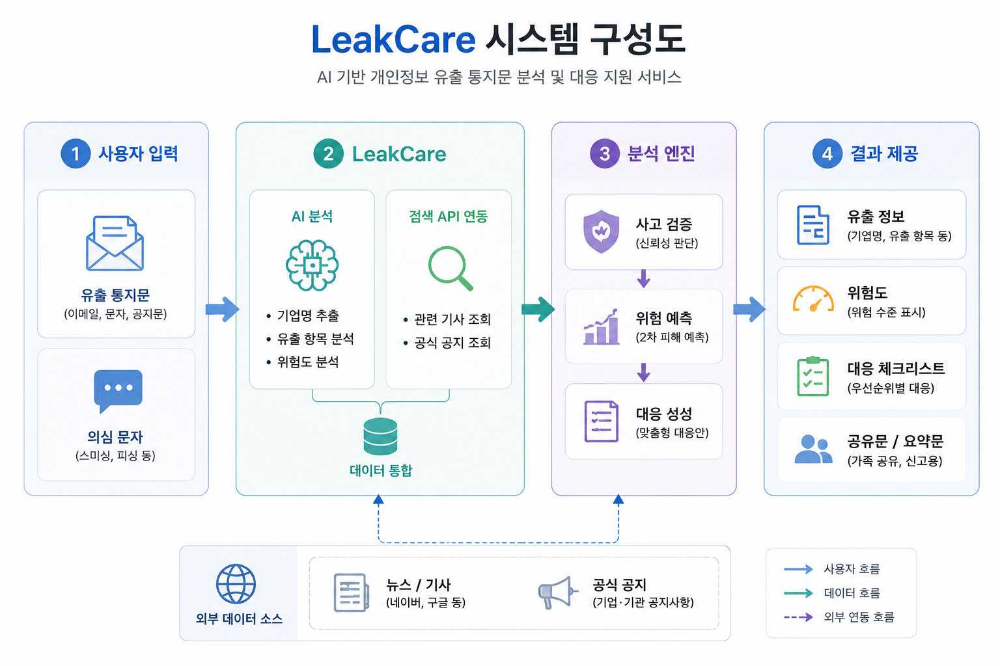

<div align="center">

<h1 style="font-size: 48px;">LeakCare</h1>

<h2>개인정보 유출 2차 피해 대응 AI 웹서비스</h2>

</div>

---

## Index

- [프로젝트 소개](#1-프로젝트-소개)
- [상세설계](#2-상세설계)
- [개발결과](#3-개발결과)
- [설치 및 사용 방법](#4-설치-및-사용-방법)
- [소개 및 시연 영상](#5-소개-및-시연-영상)
- [팀 소개](#6-팀-소개)
- [해커톤 참여 후기](#7-해커톤-참여-후기)
  
---

## 1. 프로젝트 소개
### 1.1. 개발배경 및 필요성

 최근 SK텔레콤이나 쿠팡 등에서 발생한 대규모 개인정보 유출 사고는 정보 노출 문제와 함께 택배 사칭, 보이스피싱 등 심각한 2차 피해를 낳는 사회적 문제로 대두되었다. 이러한 상황에서 사용자가 유출 사고 이후 가장 먼저 필요로 하는 것은 단순한 유출 사실 확인을 넘어 자신의 상황에 맞는 구체적인 대응 시나리오이다. 일반 사용자는 기업으로부터 유출 안내문을 받더라도 법적 표현이나 기술적 용어가 포함된 복잡한 내용 탓에 정확히 어떤 정보가 유출되었고 이것이 어떤 피해로 이어지는지 판단하기 어렵다. 또한 기존의 개인정보 포털 등은 유출 여부 조회나 일반적인 보안 수칙 안내에만 집중되어 있어, 사용자가 받은 유출 통지문을 직접 해석하고 개인별 대응 순서를 정리해 주는 실질적인 가이드는 부족한 상황이다.프로젝트를 실행하게 된 배경 및 필요성을 작성하세요.

### 1.2. 개발 목표 및 주요 내용

 본 프로젝트의 목표는 개인정보 유출 안내 문자, 이메일, 공지문을 받은 사용자가 복잡한 안내문을 직접 해석하지 않아도 자신의 상황을 빠르게 이해하고 필요한 조치를 선택할 수 있도록 돕는 AI 기반 웹서비스인 "LeakCare"를 개발하는 것이다. LeakCare는 사용자가 수신한 유출 통지문, 문자, 이메일을 AI로 분석하여 기업명을 추정하고, 관련 유출 사고 검색 및 유출 항목 확인을 거쳐 2차 피해 위험도를 분석한 뒤 최종적으로 대응 체크리스트를 생성하는 흐름으로 결과를 제공한다. 이를 통해 사용자는 자신이 받은 안내가 실제 유출 사고와 연관된 것인지 직관적으로 파악하는 동시에 비밀번호 변경, 2단계 인증 설정과 같은 기술적 조치부터 지인 사칭 예방을 위한 가족 공유까지 필수 행동 지침을 즉각적으로 이행할 수 있다.

### 1.3. 세부내용

 LeakCare는 사용자가 입력한 문자, 이메일, 공지문에서 AI가 기업명, 서비스명, 사고 키워드, 유출 항목을 추출하고, 검색 API를 활용하여 관련 기사 및 기업 공식 공지 등 외부 자료를 조회한다. 이후 입력 내용과 외부 자료를 종합적으로 분석하여 실제 유출 사고와의 관련성, 유출 정보의 종류, 예상되는 후속 위험을 판단한다. 분석 결과는 기업명, 유출 항목, 위험 유형, 판단 근거, 대응 체크리스트 등의 형태로 제공되어 사용자가 필요한 조치를 신속하게 수행할 수 있도록 지원한다.

 또한 본 서비스는 토목공학 분야의 시설물 유지관리 우선순위 결정 개념을 개인정보 유출 대응에 적용한다. 시설물의 위험도와 중요도를 평가하여 보수 우선순위를 결정하는 방식과 같이, 유출된 개인정보의 종류와 예상 피해 규모를 분석하여 대응 우선순위를 제시한다. 이를 통해 사용자는 가장 시급한 보안 조치부터 체계적으로 수행할 수 있으며, 개인정보 유출로 인한 2차 피해를 효과적으로 예방할 수 있다.

### 1.4. 기존 서비스 대비 차별

| 구분 | 기존 서비스 | LeakCare |
| --- | --- | --- |
| 분석대상 | 유출 여부 조회 | 일반 신고 중심(제공받는 정보의 한계) | 사용자가 실제 받은 문자, 메일, 공지문 |
| AI 활용 | 제한적 또는 없음 | 기업명 추출, 사고 검색, 위험도 분석.대응 생성 |
| 외부 정보 활용 | 사용자가 직접 검색 필요 | 검색 API로 관련 기사, 공지 자동 조회 |
| 결과 제공 방식 | 일반 보안 수칙 안내 | 개인별 위험도와 대응 체크리스트 제공 |
| 후속 위험 안내 | 사용자가 직접 판단 및 조치 | 스미싱, 피싱, 택배 사칭 등 위험 유형, 자동 분석 |
| 사용자 편의성 | 여러 기관, 사이트를 직접 확인해야 함 | 한 화면에서 사고 정보, 위험도,대응 방법 확인 |
| 확장 기능 | 신고, 조회 중심 | 가족 공유문, 신고용 요약문,의심 문자 분석 제공 |

LeakCare는 단순 조회·신고 중심의 기존 서비스와 달리 개인정보 유출 안내문의 해석부터 위험 분석, 맞춤형 대응 방안 제공까지 지원하는 AI 기반 통합 대응 서비스라는 점에서 차별성을 가진다.

### 1.5. 사회적가치 도입 계획

●  개인정보 유출에 따른 2차 범죄예방을 통한 사회적,경제적 피해 비용을 실질적 저감 가능하다. 사고 발생 직후 사용자가 즉각 행동할 수 있는 골든 타임 로드맵을 제공함으로써 피해구제에 투입되는 치안, 사법, 행정 비용을 저감 할 수 있다.

●  유출사고 이후 사회 전반에 확산되는 디지털 환경에 대한 불안감을 완화하고, 안심할 수 있는 디지털 상호작용 환경을 조성하여 사회적 신뢰 자본을 구축할 수 있다.

●  디지털 소외계층을 포용하는 정보 격차 해소를 실행할 수 있다. 복잡한 법적 문구와 보안 전문용어 대신 사용자에게 직관적인 언어로 재해석하여 사이버 위협에 능동적으로 대처할 수 있는 디지털 포용성을 실현가능하게 한다.

### 1.6 법적 보안적 책임 범위

#### 1.6.1 민사상 손해배상 책임 면제
 AI의 잘못된 분석으로 인해 사용자가 잘못된 조치를 취하거나 기업에 손해가 발생했다고 주장할 가능성이 있다. 이는 민법 제 750조에 따른 고의·과실로 인한 손해배상 책임 문제로 이어질 수 있다. 이에 대응하여 민법 제 105조에 규정된 당사자 간 합의 우선 원칙에 따라 유효한 약관 및 면책고지 시스템을 설계한다. 서비스 이용 전 팝업창과 안내문을 배치하여 "본 AI 분석 결과는 입력된 문자 메시지를 기반으로 한 추정치 및 참고용 정보이며, 실제 해당 기업의 공식 공지나 법적 확인 내용과 다를 수 있다"는 점을 명시한다. 이를 통해 서비스 제공자의 고의·과실 가능성을 방어하고 최종 판단 책임이 사용자에게 있음을 분명히 한다. 또한 AI가 제시하는 대응 시나리오 역시 법적 조언이 아닌 '권장 조치 사항'임을 인지시킨다. 

#### 1.6.2 웹사이트 자체의 2차 개인정보 유출 및 데이터 보안 책임
 사용자가 유출 문자를 복사하여 붙여넣는 과정에서 실명, 전화번호, 계좌번호 등 실제 개인정보가 웹사이트 서버로 유입된다. 이를 가림 처리 없이 외부로 전송할 경우, 개인정보 보호법 제17조(개인정보의 제공) 위반에 해당하여 서비스 운영자가 직접적인 법적 책임을 지게 되는 심각한 보안 리스크가 발생한다. 이에 대응하여 사용자가 문자를 입력하는 즉시 외부 API로 전송되기 전 웹사이트 서버 내부에서 마스킹 처리를 거치도록 한다. 식별 가능한 개인정보를 서버 단에서 완벽하게 제거한 후 정제된 텍스트만 외부로 송신하므로 '개인정보의 제3자 제공' 행위 자체가 성립하지 않도록 전제를 차단한다.

<br>


<br>

## 2. 상세설계
### 2.1. 시스템 구성도

<p align="center">
  
</p>

### 2.1. 사용 기술
> 스택 별(backend, frontend, designer등) 사용한 기술 및 버전을 작성하세요.
> 
> ex) React.Js - React14, Node.js - v20.0.2
> (필수)활용한 생성형 AI, AI 코딩 도구에 대해서도 기술하세요.

<br>


<br>

## 3. 개발결과
### 3.1. 전체시스템 흐름도

```text
[1] 사용자 입력
    → 개인정보 유출 문자, 이메일, 공지문 또는 의심 문자 입력
        ↓
[2] 프론트엔드 처리
    → 입력 내용을 백엔드 API로 전달
        ↓
[3] 개인정보 마스킹
    → 전화번호, 이메일, 주소 등 민감정보를 API 호출 전 자동 마스킹
        ↓
[4] AI 핵심 정보 추출
    → 기업명, 서비스명, 사고 키워드, 유출 항목 추출
        ↓
[5] 검색 API 연동
    → 기업명과 사고 키워드로 관련 기사, 공식 공지, 웹문서 검색
        ↓
[6] AI 종합 분석
    → 입력문과 외부 자료를 비교하여 사고 관련성, 위험도, 2차 피해 가능성 판단
        ↓
[7] 분석 결과 제공
    → 위험도, 유출 항목, 판단 근거, 대응 체크리스트, 가족 공유문, 신고용 요약문 제공
```

### 3.2. 기능설명
> 각 페이지 마다 사용자의 입력의 종류와 입력에 따른 결과 설명 및 시연 영상.
> 
> ex. 로그인 페이지:
> 
> - 이메일 주소와 비밀번호를 입력하면 입력창에서 유효성 검사가 진행됩니다.
> 
> - 요효성 검사를 통과하지 못한 경우, 각 경고 문구가 입력창 하단에 표시됩니다.
>   
> - 유효성 검사를 통과한 경우, 로그인 버튼이 활성화 됩니다.
>   
> - 로그인 버튼을 클릭 시, 입력한 이메일 주소와 비밀번호에 대한 계정이 있는지 확인합니다.
>   
> - 계정이 없는 경우, 경고문구가 나타납니다.
>
> (영상)

### 3.3. 기능명세서
> 개발한 제품에 대한 기능명세서를 작성해 제출하세요.
> 
> 노션 링크, 한글 문서, pdf 파일, 구글 스프레드 시트 등...

### 3.4. 디렉토리 구조

LeakCare는 Next.js 기반 웹서비스 구조로 설계하며, 화면 페이지, 백엔드 API Route, AI·검색 API 연동 로직, 개인정보 마스킹 유틸리티를 역할별로 분리한다.  
API 키와 민감정보는 GitHub에 업로드하지 않고 `.env.local` 및 배포 환경변수로 관리한다.

```text
LeakCare/
├── public/                     # 로고, 예시 이미지 등 정적 파일
├── src/
│   ├── app/                    # 메인 페이지 및 전역 스타일
│   ├── components/             # 입력창, 위험도 카드, 체크리스트 등 UI 컴포넌트
│   ├── data/                   # 시연용 Mock 분석 결과 데이터
│   ├── utils/                  # Mock 분석 함수 및 보조 함수
│   └── types/                  # 분석 결과 타입 정의
├── docs/                       # 시스템 구성도, 발표자료, 시연 자료
├── README.md
├── package.json
├── .env.example
└── .gitignore
```

> 실제 API 키가 포함된 `.env.local`은 GitHub에 업로드하지 않으며, 저장소에는 `.env.example`만 포함한다.

### 3.5 AI 도구 활용
> AI 도구를 어떤 단계에서 어떻게 활용했는지, 어떤 성과가 도출되었는지 기술해주세요.

<br>


<br>

## 4. 설치 및 사용 방법
> 제품을 설치하기 위헤 필요한 소프트웨어 및 설치 방법을 작성하세요.
>
> 제품을 설치하고 난 후, 실행 할 수 있는 방법을 작성하세요.

<br>


<br>

## 5. 소개 및 시연 영상
> 프로젝트에 대한 소개와 시연 영상을 넣으세요.
> 프로젝트 소개 동영상을 교육원 메일(swedu@pusan.ac.kr)로 제출 이후 센터에서 부여받은 youtube URL주소를 넣으세요.

<br>


<br>

## 6. 팀 소개
### 6.1 팀원 소개 & 구성원 별 역할 분담 & 간단한 연락처를 작성하세요.

<table>
  <tr>
    <th>이수빈(팀장)</th>
    <th>김재은</th>
    <th>강경민</th>
    <th>류태우</th>
  </tr>

  <tr>
    <td align="center">
      <a href="https://github.com/shoubin">
        
      </a>
    </td>
    <td align="center">
      <a href="https://github.com/kje0603">
        
      </a>
    </td>
    <td align="center">
      <a href="https://github.com/kang-kyungmin">
        
      </a>
    </td>
    <td align="center">
      <a href="https://github.com/rtw0507-eng">
        
      </a>
    </td>
  </tr>

 <tr>
    <td align="center">프론트엔드</td>
    <td align="center">백엔드</td>
    <td align="center">디자인</td>
    <td align="center">기획</td>
 </tr>
 
   <tr>
    <td align="center">정보컴퓨터공학부 2학년</td>
    <td align="center">정보컴퓨터공학부 2학년</td>
    <td align="center">사회기반시스템공학과 3학년</td>
    <td align="center">사회기반시스템공학과 3학년</td>
  </tr>


<tr>
  <td align="center">
    <a href="mailto:subins2568@gmail.com">subins2568@gmail.com</a>
  </td>
  <td align="center">
    <a href="mailto:rlatara@naver.com">rlatara@naver.com</a>
  </td>
  <td align="center">
    <a href="mailto:kkm9391@naver.com">kkm9391@naver.com</a>
  </td>
  <td align="center">
    <a href="mailto:rtw0507@naver.com">rtw0507@naver.com</a>
  </td>
</tr>
</table>

### 6.2 비전공자 전공 역량 융합 방식

1. CAD 디자인 설계 역량으로 LeakCare 웹 사이트 디자인 설계를 담당한다.

2. 토목공학 분야의 시설물 안전관리 및 재난관리에서 활용되는 위험도 평가 기법을 개인정보 유출 분야에 적용하였다. 유출된 정보의 종류와 피해 규모를 기반으로 위험 수준을 정량적으로 산정하고, 위험도에 따른 우선순위별 대응 방안을 제공함으로써 사용자의 효과적인 의사결정을 지원한다.

<br>


<br>

## 7. 해커톤 참여 후기
- 이수빈
  - 내용 작성
- 김재은
  - 내용 작성
- 강경민
  - 내용작성
- 류태우
  - 내용작성
