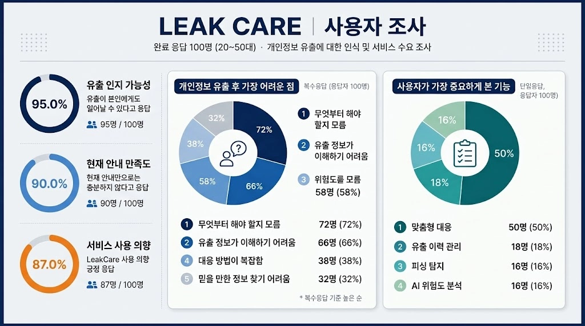
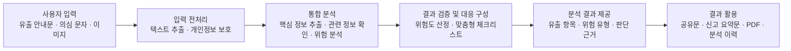
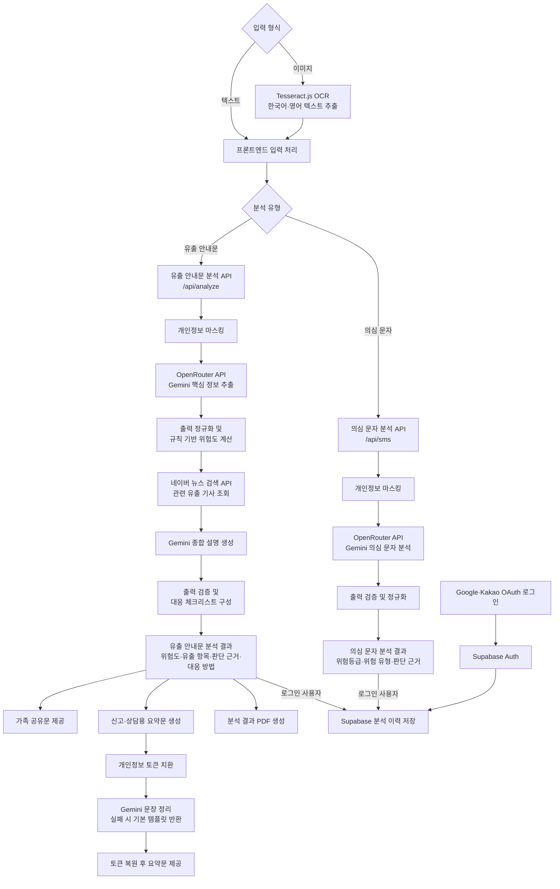

<div align="center">

<h1 style="font-size: 48px;">LeakCare</h1>

<h2>개인정보 유출 2차 피해 대응 AI 웹서비스</h2>

</div>

---

## Index

- [프로젝트 소개](#1-프로젝트-소개)
- [상세설계](#2-상세설계)
- [개발결과](#3-개발결과)
- [기대효과 및 활용방안](#4-기대효과-및-활용방안)
- [설치 및 사용 방법](#5-설치-및-사용-방법)
- [소개 및 시연 영상](#6-소개-및-시연-영상)
- [팀 소개](#7-팀-소개)
- [해커톤 참여 후기](#8-해커톤-참여-후기)
  
---

## 1. 프로젝트 소개

### 1.1. 개발배경

개인정보보호위원회 발표 자료에 따르면 최근 3년간 공공·민간을 가리지 않는 지속적·대규모 개인정보 유출 신고 건수가 급증했다. 이는 단순 정보 노출을 넘어 심각한 2차 피해로 연결되는 사회적 문제가 대두되고 있다. 또한 제공되는 유출 통지문은 법적·기술적 용어로 인해 사용자가 지금의 상황을 정확히 파악하기 어려우며 이는 조치의 우선순위와 구체적인 행동 지침의 부재로 이어져 대응의 골든타임을 놓치게 한다.

#### 실제 사용자 조사결과

20~50대 디지털기기 사용자 100명 대상으로 구글폼 설문조사 실행해봤을 때, 대다수가 대응 의사는 명확했으나 구체적인 행동 가이드라인을 알지 못 해 실행에 난항을 겪고 있었다.



이렇게 유출 발생 **이후**의 실질적인 2차 피해 예방 대책은 부재하다시피 한 상황에 더불어 복잡한 유출문을 받은 사용자에게 현재의 위험도를 명백히 제시할 필요도 있다고 생각해 LeakCare 프로젝트를 진행했다.

### 1.2. 개발 목표

본 서비스는 복잡한 개인정보 유출 안내문을 분석하여 자체 위험도 판단을 거쳐, 사용자가 피해 상황과 후속 위험을 한눈에 파악하도록 지원한다. 나아가 유출 항목에 따른 우선순위별 맞춤형 행동 지침을 즉시 제공하여 골든타임 내에 사용자의 소중한 개인정보에 대한 실질적인 보안 강화와 심리적 안정을 제공하는 것을 목표로 한다.

### 1.3. 주요 기능

**유출 통지문 분석 및 사례 검증**

유출 통지문에서 추출한 정보를 바탕으로 검색 엔진 API를 호출하여 최신 언론 보도 및 기사를 수집한다. 또한 KISA(한국인터넷진흥원), 개인 정보 보호 위원회 등 신뢰할 수 있는 기관의 데이터베이스나 해당 기업의 공식 홈페이지 공지사항과 대조하여 실제 사고 발생 여부를 확인한다.

**위험지수 진단**

개인정보보호위원회, 개인정보 포털, 한국인터넷진흥원(KISA) 등의 개인정보 분류·보호조치·유출 대응 자료를 참고하여 직접 제작한 지표를 통해 위험지수를 진단한다.

**추정치 기준 안내**
본 진단 결과는 사용자가 입력한 통지문 데이터 및 외부 공시 자료를 바탕으로 산출된 추정 수치이다.
>보다 자세한 내용은 [1.7 멘토링 결과](#17-멘토링-결과-반영)에서 보고

**맞춤형 대응 체크리스트 제공**

위험 지수로 산출한 결과를 바탕으로 시급성에 따라 사용자가 이행해야 할 필수적인 보안 조치들을 순차적으로 제시해 사용자에게 직관적인 보안 조치를 제시한다. 또한 로그인 시 제공되는 [마이페이지]-[최근 분석 이력]에 위치한 체크 박스를 통해 다시 조회할 수 있다.

**신고문 작성 요령과 가족 공유 안내문 제공**

복잡한 공공기관의 신고 절차를 사용자에게 보다 편하게 안내하기 위해 유출 통지문 분석 결과를 바탕으로 공식 신고 서식을 제공한다. 개인정보 유출이 본인에게 그치지 않고 가족에게까지 스미싱,피싱 범죄로 확대되는 것을 예방하기 위해 가족 공유용 안내문 및 분석결과를 PDF로 제공한다.

> [1.6 법적 보안적 책임](#16-법적-보안적-책임-범위)

### 1.4. 기존 서비스 대비 차별점

| 구분 | 기존 서비스 | LeakCare |
| :--- | :--- | :--- |
| 분석 대상 | 단순 유출 여부 조회 | 일반 신고 중심(제공받는 정보의 한계) |
| AI 활용 | 미적용 또는 단문 요약 수준으로 제한적 | 기업명 추출, 사고 검색, 위험도 분석·대응 생성 |
| 외부 정보 활용 | 사용자가 직접 검색 필요 | 검색 API 연동(뉴스 보도, 기업 공식 공지 실시간 수집) |
| 결과 제공 방식 | 일률적이고 정적인 일반 보안 수칙 안내 | 자체 위험지수를 통한 맞춤형 대응 체크리스트 제공 |
| 후속 위험 안내 | 사용자가 직접 판단 및 조치 | 스미싱, 피싱, 택배 사칭 등 위험 유형 자동 분석 |
| 사용자 편의성 | 여러 기관과 사이트를 직접 확인해야 함 | 한 화면에서 사고 정보, 위험도, 대응 방법 확인 |
| 확장 기능 | 신고·조회 중심 | 가족 공유문, 신고용 요약문, 의심 문자 분석 제공 |

기존 서비스들은 단순한 유출 조회와 일률적인 대응 방식을 제공한 것과 달리 본 서비스에서는 사용자 중심적으로 편의성을 높이기 위해 유출 항목 분석 단계부터 맞춤형 대응 안내까지 제공하는 것을 목적으로 한다.

### 1.5. 사회적가치 도입 계획

#### 공공·행정 비용 절감

개인정보 유출 이후 발생하는 2차 범죄를 예방하여 사회·경제적 피해 비용을 실질적으로 줄인다. 유출 직후 사용자가 골든타임 내에 즉시 대처할 수 있는 행동 로드맵을 제공함으로써, 향후 피해 구제 및 수사에 투입되는 치안·사법·행정력의 낭비를 막는다.

#### 사회적 신뢰 자본 구축

유출 사고 여파로 사회 전반에 퍼지는 막연한 공포와 디지털 서비스에 대한 불신을 완화한다. 사용자에게 '정확한 위험 유형'과 '선제적 조치 방법'을 투명하게 제시함으로써, 안심하고 일상적인 디지털 활동을 이어갈 수 있는 안전한 환경을 조성한다.

#### 정보 격차 해소

어렵고 복잡한 법률·보안 전문 용어를 누구나 이해하기 쉬운 직관적인 언어로 재해석한다. 보안 지식이 부족한 어르신이나 디지털 소외계층도 당황하지 않고 사이버 위협에 능동적으로 대처할 수 있도록 정보 접근성과 포용성을 높인다.

#### 2차 연쇄 피해 차단

개인의 정보 유출이 지인이나 부모님을 노린 사칭 범죄로 확대되는 것을 선제적으로 방지한다. 유출 유형에 맞춘 '가족 공유용 안내문'을 생성 및 전송하여 한 사람의 유출이 주변의 금전 피해로 이어지는 상황을 미리 예방한다.

### 1.6. 법적 보안적 책임 범위

#### 민사상 손해배상 책임 면제

AI의 잘못된 분석으로 인해 사용자가 잘못된 조치를 취하거나 기업에 손해가 발생했다고 주장할 가능성이 있으며 이는 민법 제 750조에 따른 고의·과실로 인한 손해배상 책임 문제로 이어질 수 있다. 이 문제에 대응해 민법 제 105조에 규정된 당사자 간 합의 우선 원칙에 따라 유효한 약관 및 면책고지 시스템을 설계한다. 서비스 이용 전 팝업창과 안내문을 배치하여 "본 AI 분석 결과는 입력된 문자 메시지를 기반으로 한 추정치 및 참고용 정보이며, 실제 해당 기업의 공식 공지나 법적 확인 내용과 다를 수 있다"는 점을 명시한다. 이를 통해 서비스 제공자의 고의·과실 가능성을 방어하고 최종 판단 책임이 사용자에게 있음을 분명히 하며 AI가 제시하는 대응 시나리오 역시 법적 조언이 아닌 '권장 조치 사항'임을 명시한다.

#### 웹사이트 자체의 2차 개인정보 유출 및 데이터 보안 책임
 
 사용자가 유출 문자를 복사하여 붙여넣는 과정에서 실명, 전화번호, 계좌번호 등 실제 개인정보가 웹사이트 서버로 유입되며, 이를 가림 처리 없이 외부로 전송할 경우 개인정보 보호법 제17조(개인정보의 제공) 위반에 해당하여 서비스 운영자가 직접적인 법적 책임을 지게 되는 심각한 보안 리스크가 발생한다. 이에 대응하여 사용자가 문자를 입력하는 즉시 외부 API로 전송되기 전 웹사이트 서버 내부에서 마스킹 처리를 거치도록 한다. 식별 가능한 개인정보를 서버 단에서 완벽하게 제거한 후 정제된 텍스트만 외부로 송신하므로 '개인정보의 제3자 제공' 행위 자체가 성립하지 않도록 전제를 차단한다.

#### AI의 법인격 및 관련자격의 부재

AI는 법적인 주체성이 부재하기에 직접적으로 서명하거나 신고를 완료할 수 없다. 따라서 문서 제출 및 신고에 따른 모든 법적 책임은 오직 작성 주체인 ‘사용자’에게 귀속되며 본 서비스는 직접적인 신고 과정이 아닌 사용자가 직접 작성, 검토할 수 있는 초안이나 표준 양식을 생성하여 사용자에게 신고 가이드라인을 제공한다.

- 법률·행정 사무 침해 가능성 비자격자인 서비스 주체가 구체적 사안에 대한 법적 판단, 추론, 권리 분석을 가미하여 신고서나 고소장을 대리 작성하고 보수를 받는 행위는 변호사법(제109조) 및 행정사법(제2조) 위반 소지가 있다.

- 생성형 AI 서비스의 규제 리스크 : 대법원 판례 등에 따르면 단순 자동 서식 생성을 넘어 생성형 AI가 구체적 사실관계를 자율 분석해 전문 서면을 구성하는 서비스는 위법성 논란이 존재한다.

### 1.7. 멘토링 결과 반영

#### 1.7.1. 실질적인 대응방안으로 서비스에서 어떤걸 제시하고 있는가?

#### 대응 체크리스트

- **바로가기 URL 제공**: 단순 행동 수칙 나열에 그치지 않고, 비밀번호 변경·2단계 인증(2FA) 설정·등 개별 서비스의 보안 설정 페이지로 즉시 이동하는 바로가기를 제공한다.

- **시급성 기반 우선순위 정렬**: LeakCare 위험지수와 연동하여 순위별로 이행 항목을 체계화한다.

#### 신고요약문 PDF 생성

- **공공기관 신고 서식 자동 패키징**: AI 분석 결과를 KISA(118) 및 경찰청 사이버범죄 신고시스템(ECRM) 제출용 표준 양식으로 구조화한다.

- **원클릭 PDF 내보내기 및 텍스트 복사**: 외부 서버로 민감정보를 전송하지 않고 브라우저 단(Client-Side)에서 사건 요약문 PDF를 생성하거나 텍스트를 복사할 수 있는 기능을 구현했다.

#### 가족 공유용 2차 피해 예방 안내문

- **연쇄 범죄 차단 맞춤 문구 생성**: 성명·연락처·주소 등 유출된 정보 조합에 맞춰, 지인 사칭 피싱이나 택배 사칭 스미싱을 주의하라는 경고 메시지를 자동 생성한다.

- **원클릭 메신저 연동**: 카카오톡 및 문자 메시지로 즉시 전송 가능한 원클릭 공유 딥링크를 배치하여 공유 절차를 최적화한다.

#### 공신력 있는 출처 기반 정보 제공

- **정부기관 자료 제공**: 개인정보보호위원회, 개인정보 포털, 한국인터넷진흥원(KISA) 등 **공공기관·전문기관의 공식 자료를 제공한다.**

- 정보 탐색 편의성 향상:  각 자료의 제목과 내용을 함께 제공하여 **필요한 정보를 빠르게 확인 할 수 있다.**

#### 1.7.2. AI의 정확도 향상을 위해 어떤 노력을 했는가?

- **AI API + Research API 연계**
    - AI에 모든 판단을 의존하지 않고, 유출 항목 추출 및 정보 구조화에 AI를 활용
    - Research API를 통해 관련 정보 및 기업 정보를 보완하여 분석 정확도 개선

- **자체 유출 항목/위험 유형 기준 설계**
    - 개인정보 유형과 2차 피해 가능성을 사전에 분류·정의하여 AI가 모든 판단을 진행하지 않음
    - 즉 단순 AI 분석이 아닌 **AI + 자체 기준 기반의 분석 체계** 구축

- **반복 분석을 통한 정확도 검증**
    - 유출 항목과 위험 유형이 명확한 샘플 안내문을 구성하여 반복 분석을 진행
    - 동일 입력에 대한 결과의 **일관성 및 재현성** 확인
    - 사전 정의된 정답 항목과 비교하여 **누락·과잉 판단 여부** 점검

- **OCR 오류 최소화**
    - OCR 결과를 즉시 AI 분석에 활용하지 않고 사용자가 추출 문장을 확인·수정할 수 있도록 설계
    - 분석 과정에서 기업명·유출 항목 등을 다시 구조화하여 오류 가능성 최소화

#### 1.7.3. 정량적인 성능지표가 있는가?

개인정보 포털, 개인정보 보호 위원회, KISA 보호나라에서 개인정보의 종류와 유형, 개인정보 영향평가 수행안내서, 계정 탈취 유형 스미싱, 피싱 대응 자료, 개인정보 유출 사고 악용 스미싱,피싱 대응자료 등을 참고해 자체적인 위험지수 판단 기준을 마련했다.

```
기본 항목 점수: 최대 60점
정보 조합 점수: 최대 25점
중요정보·직접피해 보정점수: 최대 15점
```
중요정보가 여러 개 유출되더라도 보정점수는 모두 더하지 않고 가장 높은 값 하나만 적용한다. 주민등록번호와 비밀번호가 같이 유출됐다고 해서 15+15를 더하지 않는 방식이다.

**1. 개인정보 항목별 기본 점수(최대 60점 상한)**

| 개인정보 항목 | 분류 | 기본 점수 |
|---|---|---:|
| 이름 | 일반 개인정보 / 인적사항 | 5 |
| 생년월일 | 일반 개인정보 / 인적사항 | 5 |
| 이메일 | 통신정보 | 10 |
| 주소 | 일반 개인정보 / 인적사항 | 5 |
| 주문내역 | 구매·성향 관련 정보 | 5 |
| 전화번호 | 일반 개인정보 / 연락처 | 10 |
| 계정정보 | 계정 식별정보 | 10 |
| CI | 본인확인 연계정보 | 20 |
| DI | 본인확인 식별정보 | 10 |
| 통신가입자식별정보 | 통신 가입자 식별정보 | 10 |
| 결제내역 | 구매·결제 관련 정보 | 10 |
| 계좌번호 | 신용·금융 관련 정보 | 20 |
| 카드번호 | 신용·금융 관련 정보 | 25 |
| 비밀번호 | 인증정보 | 30 |
| IMEI | 통신 단말 식별정보 | 10 |
| 통신인증정보 | 통신 인증정보 | 30 |
| 주민등록번호 | 고유식별정보 | 35 |
| 여권번호 | 고유식별정보 | 35 |
| 운전면허번호 | 고유식별정보 | 35 |
| 외국인등록번호 | 고유식별정보 | 35 |

**2. 정보 조합 가중치(최대 25점 상한)**

동일 피해 유형 그룹 내 여러 개 동시 성립 시 최고 점수 1개만 적용하며, 합계 상한은 25점

| 정보 조합 | 추가 점수 | 예상 피해 | 판단 이유 |
|---|---:|---|---|
| 이름 + 전화번호 | +5 | 개인화된 스미싱·사칭 | 이름을 알고 직접 연락할 수 있어 개인화된 사칭 가능 |
| 전화번호 + 주문내역 | +10 | 주문·배송 사칭 | 실제 구매정보를 알고 있는 것처럼 접근 가능 |
| 이름 + 전화번호 + 주소 | +15 | 정교한 개인 사칭·피싱 | 여러 식별정보가 결합돼 신뢰도 높은 개인화 사칭 가능 |
| 이름 + 전화번호 + 주문내역 | +15 | 구매·배송 사칭·피싱 | 실제 이용자를 겨냥한 구매·배송 관련 사칭 가능성이 크게 증가 |
| 이메일 + 비밀번호 | +20 | 계정 탈취 | 계정에 직접 접근하거나 다른 서비스 계정까지 공격할 가능성 증가 |
| 계좌번호 + 전화번호 | +10 | 금융기관·송금 사칭, 보이스피싱 | 실제 금융정보와 연락처를 함께 활용한 금융사칭 가능 |
| 카드번호 + 결제내역 | +15 | 무단결제·결제 사칭·금융사기 | 카드정보와 실제 결제 맥락이 결합돼 직접적인 결제 피해 가능성 증가 |

**3.중요정보 보정 가중치**

- 핵심 정보 포함 시 보정점수를 부여하며, 보정값 중 **최댓값 1개만 적용**함 (+15점 중복 합산 방지).

- **최소 등급 강제**: 계산된 점수가 낮더라도 중요 정보 유출 시 최소 위험 등급으로 자동 상승

| 중요정보 | 보정 점수 | 최소 보장 점수 | 판단 방향 |
|---|---:|---:|---|
| 주민등록번호 | +15 | 40 | 변경·회복이 어려운 고유식별정보 |
| 여권번호 | +15 | 40 | 공식 신분 확인에 사용되는 고유식별정보 |
| 운전면허번호 | +15 | 40 | 공식 신분증에 포함되는 고유식별정보 |
| 외국인등록번호 | +15 | 40 | 명의도용·본인확인에 악용 가능한 고유식별정보 |
| 비밀번호 | +15 | 40 | 계정 접근에 직접 사용되는 인증정보 |
| 카드번호 | +10 | 20 | 무단결제 등 직접적인 금융피해 가능 |
| 계좌번호 | +10 | 20 | 금융사기·금융기관 사칭에 활용 가능 |

#### 최종 위험등급 기준

| 최종 점수 | 위험 수준 | 의미 |
| :---: | :---: | :--- |
| 0~19점 | 낮음 | 직접적인 피해 가능성은 비교적 낮지만 유출 사실 확인과 기본적인 주의가 필요 |
| 20~39점 | 보통 | 피싱·스미싱·금융 사칭 등에 활용될 가능성이 있어 계정 점검과 대응 필요 |
| 40~100점 | 높음 | 계정 탈취·명의도용·금전 피해 등 직접적인 2차 피해 가능성이 있어 즉시 대응 필요 |

---

## 2. 상세설계

### 2.1. 시스템 구성도


```mermaid
flowchart LR
    A["사용자 입력<br/>유출 안내문 · 의심 문자 · 이미지"]
    B["입력 전처리<br/>텍스트 추출 · 개인정보 보호"]
    C["통합 분석<br/>핵심 정보 추출 · 관련 정보 확인 · 위험 분석"]
    D["결과 검증 및 대응 구성<br/>위험도 산정 · 맞춤형 체크리스트"]
    E["분석 결과 제공<br/>유출 항목 · 위험 유형 · 판단 근거"]
    F["결과 활용<br/>공유문 · 신고 요약문 · PDF · 분석 이력"]

    A --> B --> C --> D --> E --> F
```

사용자의 입력문에서 텍스트를 추출하고 개인정보를 자동으로 마스킹한다. 이후 AI 분석과 뉴스 검색을 결합해  다시 확인하고, 규칙 기반 위험도·대응 체크리스트와 근거 자료를 제공한다. 분석 결과와 체크리스트 진행 상태는 안전하게 저장되어 사용자가 이후에도 확인 가능하다.

### 2.2. 사용 기술

| 구분 | 사용 기술 | 활용 내용 |
| :--- | :--- | :--- |
| 실행 환경 | Node.js, npm | 애플리케이션 실행 및 패키지 관리 |
| 프론트엔드 | Next.js, React | 사용자 화면과 반응형 인터페이스 구현 |
| 백엔드·API | Next.js Route Handlers | AI 분석, 요약문 생성 및 분석 이력 API 구현 |
| 개발 언어 | TypeScript | 프론트엔드와 백엔드 코드 작성 |
| 생성형 AI | OpenRouter API, Google Gemini 3.7 Flash | 유출 안내문 및 의심 문자 분석, 설명문과 요약문 생성 |
| 이미지 문자 인식 | Tesseract.js | 안내문과 문자 이미지에서 한국어·영어 텍스트 추출 |
| 외부 정보 검색 | 네이버 뉴스 검색 API | 관련 개인정보 유출 기사 검색 |
| 데이터베이스·인증 | Supabase, Google·Kakao OAuth | 사용자 로그인과 분석 이력 저장·관리 |
| 문서 생성 | pdf-lib, @pdf-lib/fontkit | 분석 결과 PDF 생성 및 한글 글꼴 적용 |
| 배포 | Vercel | 웹서비스 배포 및 운영 |
| 형상관리 | Git, GitHub | 소스 코드 버전 관리와 팀 협업 |
| 개발 보조 AI | ChatGPT, OpenAI Codex, Gemini, GitHub Copilot, 
Cursor | 코드 작성, 오류 분석, 리팩터링 및 문서 작성 보조 |

---

## 3. 개발결과

### 3.1. 전체시스템 흐름도


```mermaid
flowchart TD
    B{"입력 형식"}

    B -->|이미지| C["Tesseract.js OCR<br/>한국어·영어 텍스트 추출"]
    B -->|텍스트| D["프론트엔드 입력 처리"]
    C --> D

    D --> E{"분석 유형"}

    E -->|유출 안내문| F["유출 안내문 분석 API<br/>/api/analyze"]
    E -->|의심 문자| G["의심 문자 분석 API<br/>/api/sms"]

    F --> H["개인정보 마스킹"]
    H --> I["OpenRouter API<br/>Gemini 핵심 정보 추출"]
    I --> J["출력 정규화 및<br/>규칙 기반 위험도 계산"]
    J --> K["네이버 뉴스 검색 API<br/>관련 유출 기사 조회"]
    K --> L["Gemini 종합 설명 생성"]
    L --> M["출력 검증 및<br/>대응 체크리스트 구성"]
    M --> N["유출 안내문 분석 결과<br/>위험도·유출 항목·판단 근거·대응 방법"]

    G --> O["개인정보 마스킹"]
    O --> P["OpenRouter API<br/>Gemini 의심 문자 분석"]
    P --> Q["출력 검증 및 정규화"]
    Q --> R["의심 문자 분석 결과<br/>위험등급·위험 유형·판단 근거"]

    N --> S["가족 공유문 제공"]
    N --> T["신고·상담용 요약문 생성"]
    T --> U["개인정보 토큰 치환"]
    U --> V["Gemini 문장 정리<br/>실패 시 기본 템플릿 반환"]
    V --> W["토큰 복원 후 요약문 제공"]

    N --> X["분석 결과 PDF 생성"]
    N -->|로그인 사용자| Y["Supabase 분석 이력 저장"]
    R -->|로그인 사용자| Y

    Z["Google·Kakao OAuth 로그인"] --> AA["Supabase Auth"]
    AA --> Y
```

### 3.2. 기능설명

#### 3.2.1 시작 페이지

본 서비스에 대한 간략한 개요를 제공한다.

- 중앙의 유출 안내문 분석하기/의심 문자 분석하기 버튼을 통해 각 기능으로 이동할 수 있다.

- 배너의 네비게이션 바를 통해 각 페이지로 이동할 수 있다.

#### 3.2.2 로그인 페이지

- 사용자가 시작페이지(3.2.1)의 배너에 있는 **[로그인]** 탭을 클릭하거나, 비로그인 상태에서 분석 이력 저장 등 회원 전용 기능 접근 시 본 로그인 페이지로 이동한다.

- 별도의 복잡한 아이디/비밀번호 입력 폼을 생략하고 대표 소셜 계정 기반의 **[Google로 로그인]** 및 **[Kakao로 로그인]** 버튼을 제공한다.

- 로그인 후 배너페이지로 이동하며 이후 마이페이지 기능을 사용할 수 있다. 

#### 3.2.3 이용안내 페이지

- 사용자가 시작페이지(3.2.1)의 배너 **[이용 안내]** 탭을 클릭하면 LeakCare의 전체 사후 관리 프로세스를 스크롤 형태로 확인 가능한 가이드 페이지로 이동한다.

#### 3.2.4 이용약관 페이지

- 위험지수 산정 기준 및 한계 고지

- 사용자가 시작페이지(3.2.1)의 배너 **[이용 안내 / 이용 약관]** 탭을 클릭하면 해당 페이지로 이동하며, 위험지수 공식 출처 근거를 제시한다.

#### 3.2.5 유출안내문 분석 페이지

- 사용자가 통지받은 개인정보 유출 안내문 텍스트를 메인 입력창에 직접 입력하거나 이미지를 추가할 수 있다.

- 실제 통지문 없이도 서비스 프로세스를 미리 체험해 볼 수 있도록 유출 안내문 예시가 제공된다.

- **[초기화]** 버튼 클릭 시 입력창의 텍스트 및 첨부된 이미지 데이터가 완전히 삭제되고 초기 상태로 리셋된다.

- **[AI 분석하기]** 버튼 클릭 시 AI 분석이 시작되며 로딩 화면으로 전환된다.

#### 3.2.6 유출안내문 분석 결과 페이지

- 입력된 통지문 분석 완료 시 산출된 종합 위험 점수와 해당 위험 등급이 대시보드 상단에 표시된다.

- 입력된 통지문에서 추출한 유출 항목과 발생 가능한 2차 범죄 유형을 태그 형태로 표시한다.

#### 3.2.7 유출안내문 분석 대응 체크리스트 페이지

- 유출 항목 진단 결과에 따라 나오는 대응 체크리스트가 즉시 이행해야 할 보안 조치 항목 순번과 시급도 태그로 정렬되어 제공된다.

- 유출이 확인되거나 영향이 있는 서비스의 보안 설정 페이지로 진입할 수 있는URL을 제공한다.

- 추가적인 전문 상담이나 공식 피해 신고가 필요한 경우를 위해 주요 공공기관 접수 창구 연결 바로가기 링크를 제공한다.

#### 3.2.8 가족 공유용 안내문 페이지

- `[안내문 복사]` 클릭 시 생성된 경고 문구가 클립보드에 즉시 복사된다. 

- `[공유하기]`클릭 시 공유용 안내문을 공유할 수 있다.

- `[PDF 저장]`클릭 시 생성된 내용과 분석 내용을 모두 요약한 PDF 파일 다운이 가능하다.

#### 3.2.9 신고상담용 요약문

- 이전 단계에서 AI가 추출한 핵심 유출 정보(`기업명`, `유출 항목`)가 자동으로 매핑되며 사용자가 입력한 세부 내용을 바탕으로 요약문을 제공한다.

- 작성 완료 후 하단 요약 버튼을 클릭하면 입력된 정형/비정형 데이터를 경찰청 및 KISA 상담에 최적화된 표준 사건 요약서 격식으로 즉시 구조화한다.

#### 3.2.10 의심문자 분석페이지

- 사용자가 스미싱 의심 문자 메시지를 메인 입력해야 하며, 입력 필드가 비어있거나 유효하지 않은 형태일 때는 입력 촉구 안내 메시지를 노출한다.

- 문자 텍스트 복사가 어려운 사용자를 위해 스크린샷 캡처 이미지를 직접 분석할 수 있는 **[이미지 업로드]** 기능을 제공하며 OCR 기능을 통해 텍스트가 추출된다.

- 실제 통지문 없이도 서비스 프로세스를 미리 체험해 볼 수 있도록 유출 안내문 예시가 제공된다.

- `[초기화]` 버튼 클릭 시 입력창의 텍스트 및 첨부된 이미지 데이터가 완전히 삭제되고 초기 상태로 리셋된다.

- `[AI 분석하기]` 버튼 클릭 시 입력된 문자의 위험 등급 분석이 시작된다.

#### 3.2.11 의심문자 분석 결과 페이지

- 의심문자를 분석하여 위험도와 가능한 범죄 유형을  태그 형식으로 요약 제시한다. 

#### 3.2.12 의심문자 대응 체크리스트 페이지

- 사용자가 즉시 이행해야 할 핵심 수칙을 정렬해 제공한다.

- 피해 확산을 막고 전문 상담을 받을 수 있도록 주요 공공기관 채널의 `[바로가기]`를 배치한다.
    
- AI 분석 및 위험도 판별의 기준이 된 공공기관 공식 지침과 가이드라인 원문 바로가기(`[원문 보기]`)를 제공하여 서비스의 근거를 제시한다.

#### 3.2.13 마이페이지

- 현재 로그인된 계정의 연동 상태(카카오 소셜 및 구글 로그인 아이콘) 및 식별 이메일 주소를 명시한다.

- 사용자가 과거 진단한 '의심 문자 분석' 및 기업별 '유출 안내문 분석' 이력을 최신순으로 목록화하여 제공하며 이력 카드별로 과거 분석 내용을 보여준다.

- 각 유출 안내문 분석 건에 대해 사용자가 대응 체크리스트를 얼마나 이행했는지 진행률(0%~100%)로 표시한다.

#### 3.2.14 미확인 체크리스트 알람

- 사용자의 과거 분석 이력 중 진행률이 100% 미만인 미완료 유출 대응 체크리스트가 존재할 경우 화면 내에 플로팅 배너 형태의 리마인더 팝업을 띄운다.

### 3.3 디렉토리 구조
```
LeakCare/
├── public/                     
│
├── docs/                       # 시스템 구성도, 화면 자료 및 프로젝트 문서
│
├── src/
│   ├── app/                    # Next.js App Router 기반 페이지 및 API
│   │   ├── page.tsx            # 시작 페이지
│   │   ├── banner/             # 서비스 소개 및 이용 안내 페이지
│   │   ├── leak/               # 개인정보 유출 안내문 분석 페이지
│   │   ├── sms/                # 의심 문자 분석 페이지
│   │   ├── login/              # Google·Kakao 로그인 페이지
│   │   ├── mypage/             # 분석 이력 및 체크리스트 관리 페이지
│   │   ├── auth/               # OAuth 로그인 콜백 처리
│   │   ├── api/                # 분석, 문자, 요약문 및 이력 관리 API
│   │   ├── globals.css         # 전역 스타일
│   │   ├── layout.tsx          # 공통 레이아웃
│   │   └── manifest.ts         # 웹 앱 Manifest 설정
│   │
│   ├── components/             # 내비게이션, 알림 등 공통 UI 컴포넌트
│   │
│   ├── data/                   # 위험도 기준, 대응 규칙 및 관련 기관 정보
│   │
│   ├── lib/                    # Gemini, 검색, OCR, Supabase 및 보고서 연동 로직
│   │
│   ├── types/                  # 분석 결과, 사용자 및 보고서 타입 정의
│   │
│   └── utils/                  # 개인정보 마스킹 등 공통 유틸리티
│
├── .env.example                # 환경변수 예시
├── .gitignore                  
├── package.json                # 프로젝트 의존성과 실행 스크립트
├── package-lock.json           # npm 의존성 버전 고정
├── tsconfig.json               # TypeScript 설정
└── README.md         
```


### 3.4 AI 도구 활용
#### 제품 내 AI (OpenRouter · Gemini 3.7 Flash)

- **개인정보 유출 안내문 분석:** 사용자가 입력한 문자·이메일·공지문에서 기업명, 서비스명, 유출 항목과 예상 위험 유형을 구조화된 JSON 형식으로 추출
- **관련 사고 검색 및 분석 보조:** 추출한 기업명을 기반으로 네이버 뉴스 검색 API에서 관련 기사를 조회하고, 검색 결과를 참고 자료로 활용해 분석 근거와 설명 생성
- **의심 문자 분석:** 문자에 포함된 링크, 내용, 개인정보·금전 요구 및 긴급성을 분석하여 스미싱·피싱 위험도와 판단 근거 제공
- **공유·신고 문서 생성:** 분석 결과를 바탕으로 가족에게 전달할 예방 안내문과 기관 상담·신고에 활용할 수 있는 사실 중심 요약문 생성
- **개인정보 보호:** 외부 AI 호출 전에 이름, 전화번호, 이메일, 주소, 주민등록번호, 카드번호, 계좌번호 등을 서버에서 마스킹하여 실제 개인정보의 외부 전달 최소화
- **AI 결과 보완:** 위험점수와 최종 위험등급, 대응 체크리스트는 AI가 임의로 결정하지 않도록 별도의 규칙 기반 로직으로 계산

#### 개발 과정 AI

개발 과정에서는 AI 도구를 기능 설계, 코드 작성 보조, 오류 분석 및 품질 개선에 활용한다.
| 단계 | 주요 도구 | 활용 내용 |
| :--- | :--- | :--- |
| 기획 | 생성형 AI | 개인정보 유출 이후 사용자 대응 흐름 정리, 주요 기능과 예외 상황 도출 |
| 설계 | 생성형 AI | Next.js API 구조, AI 분석·검색·규칙 기반 처리 흐름 및 데이터 구조 설계 보조 |
| AI 연동 | 생성형 AI 기반 코딩 도구 | OpenRouter 기반 Gemini 호출, JSON 응답 파싱, 프롬프트 및 타임아웃 처리 구현 보조 |
| 개인정보 보호 | 생성형 AI 기반 코딩 도구 | 개인정보 마스킹과 임시 토큰 치환·복원 로직 작성 및 정규식 검토 |
| 위험도·대응 로직 | 생성형 AI 기반 코딩 도구 | 유출 항목별 위험도 계산, 항목 별칭 정규화, 맞춤형 체크리스트 로직 개선 |
| 프론트엔드 | 생성형 AI 기반 코딩 도구 | 분석 화면, 의심 문자 분석, 결과 표시, 반응형 UI 및 사용자 안내 문구 개선 |
| 테스트·디버깅 | 생성형 AI 기반 코딩 도구 | TypeScript·Next.js 오류 분석, 잘못된 JSON·API 지연·검색 실패 등 예외 상황 점검 |
| 문서화 | 생성형 AI | 시스템 흐름, AI 활용 범위, 안전장치 및 README 설명 초안 작성 보조 |

AI가 생성한 코드는 그대로 반영하지 않고 팀원이 기존 타입과 API 구조의 일치 여부를 검토한다. 또한 실제 예시 입력을 이용해 AI가 원문에 없는 유출 정보나 피해 사실을 추가하지 않는지 확인하고, 빌드 검사와 PC·모바일 환경의 기능 테스트를 거쳐 수정한다.

특히 신뢰성이 중요한 **개인정보 보호, 위험도 산정 및 대응 조치 선정은 생성형 AI에만 의존하지 않는다.** AI 응답은 허용된 형식으로 검증·정규화하며, 검색 API 실패 시 분석을 계속하고 AI 요약 생성 실패 시 기본 템플릿을 반환하도록 예외 처리를 거쳤다.

> AI 적용 범위, 개인정보 보호 방식, 출력 검증, 예외 처리 및 고도화 과정에 관한 자세한 내용은 [AI 활용 및 고도화 문서](docs/ai-usage.md)에서 확인할 수 있다.

---

## 4. 기대효과 및 활용방안

### 4.1. 기대효과

- **골든타임 내 2차 피해 예방**: 복잡한 유출 통지문과 의심 문자를 AI가 실시간 분석해 즉시 실행할 체크리스트를 제공함으로써 보이스피싱·스미싱 등의 2차 피해를 선제적으로 차단한다.

- **디지털 취약계층 포용**: 어려운 기술·법률 용어 대신 100점 만점 기준의 위험지수와 태그로 보여주어 디지털 취약계층도 위험성을 쉽게 이해하도록 돕는다.

- **신고 절차 안내**: 경찰청 및 KISA 제출에 최적화된 사건 요약서를 자동 작성하고 신고 가이드라인을 제시하여 사용자의 복잡한 신고 및 상담 문턱을 대폭 낮춘다.

- **가족 단위 보안 안전망 구축**: 경고문 공유 기능으로 디지털에 익숙지 않은 부모님에게 빠르게 위험을 알리고 대응을 도울 수 있다.

### 4.2. 활용방안

- **포인트 선순환 및 리텐션 강화**: 적립된 포인트는 프리미엄 AI 심층 분석권 구매, PDF 리포트 무제한 다운로드, 또는 모바일 기프티콘 교환에 활용할 수 있게 하여 사용자의 재방문율과 앱 체류 시간을 대폭 향상시킬 수 있다.

- **공공·민간 개인정보 보호 서비스와 연계**: 개인정보 포털, KISA, 경찰청 등 **신고·상담 기관과 연계하여 분석 → 대응 → 신고까지 연결할 수 있다.** 
또한 향후 유출 사고 데이터가 축적되면 **유출 유형 및 피해 위험에 대한 통계·분석 서비스로 확장**할 수 있다.

---

## 5. 설치 및 사용 방법

LeakCare는 별도의 프로그램 설치 없이 PC 또는 모바일 웹 브라우저에서 이용할 수 있는 웹서비스이다. 사용자는 아래 배포 링크로 접속하여 개인정보 유출 안내문 및 의심 문자 분석 기능을 바로 사용할 수 있다.

> [LeakCare 바로가기]( https://leakcare.vercel.app)

---

## 6. 소개 및 시연 영상

아래 링크에서 LeakCare의 주요 기능과 전체 서비스 이용 과정을 확인할 수 있다.

> [LeakCare 소개 및 시연 영상](https://youtu.be/AjiW2Q2yzAI?si=4rmRj23fGEVVFHG0)

---

## 7. 팀 소개

<table>
  <tr>
    <th>이수빈(팀장)</th>
    <th>김재은</th>
    <th>강경민</th>
    <th>류태우</th>
  </tr>
  <br>

  <br> 
   <tr>
    <td align="center">정보컴퓨터공학부 2학년</td>
    <td align="center">정보컴퓨터공학부 2학년</td>
    <td align="center">사회기반시스템공학과 3학년</td>
    <td align="center">사회기반시스템공학과 3학년</td>
  </tr>


<tr>
  <td align="center">
    <a href="mailto:subins2568@gmail.com">subins2568@gmail.com</a>
  </td>
  <td align="center">
    <a href="mailto:rlatara@naver.com">rlatara@naver.com</a>
  </td>
  <td align="center">
    <a href="mailto:kkm9391@naver.com">kkm9391@naver.com</a>
  </td>
  <td align="center">
    <a href="mailto:rtw0507@naver.com">rtw0507@naver.com</a>
  </td>
</tr>
</table>

- 이수빈: PM,Backend Developer,AI,Infra,QA
- 김재은: Frontend Developer,UI/UX Designer
- 강경민: Research,QA
- 류태우: UI/UX · Visual Design,Research


---

## 8. 해커톤 참여 후기
- **이수빈**
  - 처음 나오는 해커톤이라 기대도 되었지만 그만큼 걱정을 많이했다. 내가 가진 역량으로 목표까지 도달 할 수 있을지 의문을 품은 채 시작했지만, 할 수 있는 만큼 최선을 다해 부딪혀 보자는 마음으로 참여했다. 익숙하지 않은 것들을 직접 경험하면서 단순히 기능을 구현하는 것 이상으로 많은 것을 배울 수 있었다. 직접 떠올린 아이디어가 많은 노력을 거쳐 실제 서비스의 형태로 구현되고 완성되는 과정을 보는 그 성취감을 잊지 못할 것이다. 부족한 점도 많았지만, 이번 해커톤을 통해 내가 할 수 있는 범위가 생각보다 넓다는 것을 알게되며 자신감도 얻게 되었다. 처음이라 더 많이 고민하고 헤맸던 만큼, 그 과정 자체가 의미있는 경험이었고, 이번 경험을 바탕으로 앞으로 더 발전할 내가 기대된다.

- **김재은**
  - 처음 참여한 프로젝트라 무엇을 어떻게 시작해야 할지조차 몰라 막막했지만 직접 부딪혀 가며 하나씩 배워나갈 수 있었다. 쉬운 기간은 아니었지만 결과물을 구현해낸 것에 큰 보람을 느낄 수 있었으며, 스스로의 부족한 점을 발견하고 해결해 나가는 과정에서 한 단계 성장할 수 있었다. 앞으로의 나에게 큰 도움이 될
   소중한 경험이었으며 새로운 도전에 자신감을 얻을 수 있었던 좋은 기회였다.

- **강경민**
  - 비전공자로서 해커톤이라는 주제를 처음 접했을때 다소 생소하고 어려움을 겪었다. 그러나 팀원들과의 브레인스토밍과 지속적인 논의를 통해, 전공 간 융합의 중요성을 배울 수 있었다. 또한 SW 전공자들과 협업하며 문제를 분석하고 서비스를 구체화하는 경험을 통해 시야를 넓힐 수 있었으며, 기술을 활용한 사회문제 해결에 대한 관심과 이해를 높일 수 있는 의미 있는 경험이 되었다.

- **류태우**
  - 이번 AI해커톤을 통해서 IT분야의 공모전을 처음 나가게 되어 내가 가진 전공 역량을 어떻게 하면 잘 적용할 수 있을지 고민이 많이 되었다. 디자인 설계나 위험도 분석과 같은 여러가지 아이디어를 생각해보았고 개인정보 유출 위험도 결정에 적용 할 수 있었다. 또한 AI도구들이 어떤 기능을 하며 어떻게 적용 할 수 있는지,  또한 웹에 대한 기초 바탕들을 공부 할 수 있게 되어 유익한 경험이 되었다.
