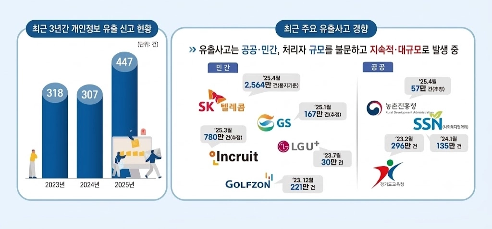
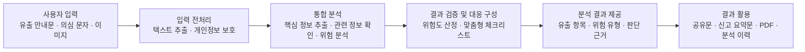
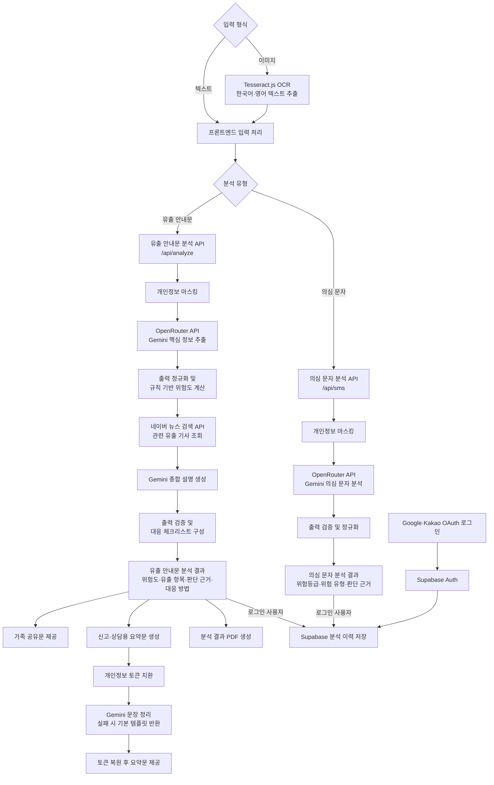

<div align="center">

<h1 style="font-size: 48px;">LeakCare</h1>

<h2>개인정보 유출 2차 피해 대응 AI 웹서비스</h2>

</div>

---

## Index

- [프로젝트 소개](#1-프로젝트-소개)
- [상세설계](#2-상세설계)
- [개발결과](#3-개발결과)
- [설치 및 사용 방법](#4-설치-및-사용-방법)
- [소개 및 시연 영상](#5-소개-및-시연-영상)
- [팀 소개](#6-팀-소개)
- [해커톤 참여 후기](#7-해커톤-참여-후기)
  
---

## 1. 프로젝트 소개
### 1.1. 개발배경 및 필요성
#### 개인정보 유출 사고의 급증 및 대형화
- 개인정보보호위원회 발표 자료에 따르면, 최근 3년간 개인정보 유출 신고 건수가 급증(2023년 318건 → 2024년 307건 → 2025년 447건, 약 45% 증가).
- 공공·민간을 가리지 않고 지속적·대규모 유출 발생 (SK텔레콤 2,564만 건, 인크루트 780만 건, 경기도교육청 296만 건 등).
- 단순 정보 노출을 넘어 택배 사칭, 보이스피싱, 피싱·스미싱 등 심각한 2차 피해로 연결되는 사회적 문제 대두

#### 유출 통지문의 복잡성과 사용자 대응 능력의 한계
- 법적·기술적 용어로 가득 찬 유출 안내문 탓에 사용자가 정확히 어떤 정보가 노출되었고, 어떤 위험이 있는지 판단하기 어려움.
- 유출 통지를 받아도 골든타임 내에 당장 무엇부터 조치해야 하는지 우선순위와 구체적인 행동 지침이 부재.


#### 기존 보안 앱의 한계 및 실질적 원스톱 솔루션 부재
- 기존 개인정보 관련 포털이나 기존 서비스들은 단순 유출 여부 조회 및 일반적인 보안 수칙 안내에만 치중.
- 사용자가 전달받은 유출 통지문을 분석하여 개인별 대응 순서를 정리해 주고 실천을 돕는 전용 앱 서비스의 부재.
출처: [개인정보보호위원회](https://www.pipc.go.kr/)

#### 실제 사용자 조사결과
- 20~50대 디지털기기 사용자 100명 대상으로 구글폼 설문조사 실행
- 대다수가 대응 의사는 명확하나, 구체적인 행동 가이드라인을 알지 못해 실행에 난항


#### 필요성
●  일상이 된 개인 정보 유출 사태 

→ 개인정보 유출이 일상적인 위협이 됨에 따라 유출 발생 '이후'의 실질적인 2차 피해 예방 대책이 부재하는 실정

●  귀찮고 복잡한 기존의 유출통지문 

→ 법적 표현 및 기술적 용어로 가득한 복잡한 유출 통지문을 쉽게 해석하고, 현재의 위험 상황도를 명백히 제시 필요

●  대응 지침이 마련되어 있지 않은 기존의 플랫폼

→ 단순한 유출 조회를 넘어선 비밀번호 변경, 이중인증 설정, 국가기관에 신고 등 여러 사이트에 분산된 대응 조치를 연계할 필요
 

### 1.2. 개발 목표 및 주요 내용
#### 1.2.1. 개발 목표

본 서비스에서는 복잡한 개인정보 유출 안내문을 분석하여 자체 위험도 판단을 거쳐, 사용자가 피해 상황과 후속 위험을 한눈에 파악하도록 지원합니다. 나아가 유출 항목에 따른 우선순위별 맞춤형 행동 지침을 즉시 제공하여 골든타임 내에 사용자의 소중한 개인정보에 대한 실질적인 보안 강화와 심리적 안정을 제공하는 것을 목표로 합니다.

#### 1.2.2. 주요 내용

●  유출 통지문 분석 및 사례 검증 : 복잡한 유출 통지문을 AI가 해석 및 교차 검증하여 관련 기업과 실제 유출 사고 연관성을 분석 후 유출 항목을 추출.

●  위험지수 진단 :  유출 항목별 기본점수, 여러 개인정보가 결합됐을 때의 조합 위험, 금융·인증·고유식별정보의 직접 피해 가능성을 종합하여 사용자의 위험도 산출

●  맞춤형 대응 체크리스트 제공 : 비밀번호 변경, 2단계 인증 설정 등 골든타임 내 즉시 실행해야 할 필수 기술적 조치 단계를 우선순위별로 제시

●  신고문 작성 요령과 가족 공유용 안내문 제공 : 복잡한 신고 절차를 돕는 신고 가이드라인과 가족 공유용 안내문을 자동 생성해 2차 피해를 예방

## 1.3. 세부내용

#### 유출 통지문 분석 및 사례 검증

추출한 '기업명 + 유출 사고 키워드'를 바탕으로 검색 엔진 API를 호출하여 최신 언론 보도 및 기사를 수집합니다. 또한 KISA(한국인터넷진흥원), 개인 정보 보호 위원회 등 신뢰할 수 있는 기관의 데이터베이스나 해당 기업의 공식 홈페이지 공지사항과 대조하여 실제 사고 발생 여부를 확인합니다.

●  **자동 마스킹 처리**: 분석을 위해 서버로 데이터를 전송하기 전, 사용자가 입력한 통지문 내에 포함될 수 있는 개인 식별 정보(전화번호, 이름, 주소, 이메일 등)를 정규식표현(Regex) 및 로컬 모델을 통해 선제적으로 `***` 형태로 마스킹합니다.

#### 위험지수 진단

개인정보보호위원회, 개인정보 포털, 한국인터넷진흥원(KISA) 등의 개인정보 분류·보호조치·유출 대응 자료를 참고하여 제작한 지표를 통해 위험지수를 진단합니다。
최종 점수는 유출 항목별 기본점수, 정보 결합에 따른 조합 위험, 금융·인증·고유식별정보의 직접 피해 가능성을 종합하여 최대 100점으로 산출됩니다. 

●  **추정치 기준 안내**: 본 진단 결과는 사용자가 입력한 통지문 데이터 및 외부 공시 자료를 바탕으로 산출된 추정 수치입니다.
보다 자세한 내용은 [1.7 멘토링 결과](#17-멘토링-결과-반영)에서 보고

#### 맞춤형 대응 체크리스트 제공

위험 지수로 산출한 결과를 바탕으로 시급성에 따라 사용자가 이행해야 할 필수적인 보안 조치들을 순차적으로 제시합니다.  대응 체크리스트에서는 사용자에게 직관적인 보안 조치를 제시하고  비밀번호 변경과 같은 보안조치 이행을 위한 유출 사건 사이트 URL을 바로 제공 하고 있습니다. 또한 위험도에 맞춘 직관적 색상으로 시급성을 각인 시키고, [마이페이지]-[최근 분석 이력]에 위치한 체크 박스를 통해 조치 완료 상태를 실시간으로 관리할 수 있도록 구현했습니다.

●  **실시간 완료 트래킹 (Checklist & Progress Bar)**: 체크박스 선택 시 이행률(%) 및 진행 바(Progress Bar)가 실시간 충전되어 완료 현황 파악 기능을 제공합니다.

#### 신고문 작성 요령과 가족 공유 안내문 제공

복잡하고 작성해야할 내용이 많은 공공기관의 신고 절차를 사용자에게 보다 편하게 안내하기 위해 유출 통지문 분석 결과를 바탕으로 공식 신고 서식을 제공하고 있습니다.  기업명 , 사고 인지 시점, 유출항목등은 자동 구조화되어 있습니다. 개인정보 유출이 본인에게 그치지 않고 가족에게 스미싱,피싱 범죄로 확대되는 것을 예방하기 위해 가족 공유용 안내문 및 분석결과를 PDF로 제공하고 있습니다.

●  **표준 신고 양식 자동 패키징**: 피의 기업명, 사고 인지 시점, 유출 항목, 예상 2차 피해 유형을 개인정보침해신고센터(118) 및 사이버범죄 신고시스템(ECRM) 제출용 양식으로 자동 구조화합니다.
-> [1.6 법적 보안적 책임](#16-법적-보안적-책임-범위)

●  **One-Click 메신저 연동**: 카카오톡 알림/문자 메시지로 즉시 전송 가능한 원클릭 공유 버튼 배치.


## 1.4. 기존 서비스 대비 차별

| 구분 | 기존 서비스 | LeakCare |
| :--- | :--- | :--- |
| 분석 대상 | 단순 유출 여부 조회 | 일반 신고 중심(제공받는 정보의 한계) |
| AI 활용 | 미적용 또는 단문 요약 수준으로 제한적 | 기업명 추출, 사고 검색, 위험도 분석·대응 생성 |
| 외부 정보 활용 | 사용자가 직접 검색 필요 | 검색 API 연동(뉴스 보도, 기업 공식 공지 실시간 수집) |
| 결과 제공 방식 | 일률적이고 정적인 일반 보안 수칙 안내 | 자체 위험지수를 통한 맞춤형 대응 체크리스트 제공 |
| 후속 위험 안내 | 사용자가 직접 판단 및 조치 | 스미싱, 피싱, 택배 사칭 등 위험 유형 자동 분석 |
| 사용자 편의성 | 여러 기관과 사이트를 직접 확인해야 함 | 한 화면에서 사고 정보, 위험도, 대응 방법 확인 |
| 확장 기능 | 신고·조회 중심 | 가족 공유문, 신고용 요약문, 의심 문자 분석 제공 |

기존 서비스들은 단순한 유출 조회와 일률적인 대응 방식을 제공한 것과 달리 본 서비스에서는 사용자 중심적으로 편의성을 높이기 위해 유출 항목 분석 단계부터 맞춤형 대응 안내까지 제공하는 것을 목적으로 하고 있습니다.

## 1.5. 사회적가치 도입 계획

#### 공공·행정 비용 절감

개인정보 유출 이후 발생하는 2차 범죄를 예방하여 사회·경제적 피해 비용을 실질적으로 줄입니다. 유출 직후 사용자가 골든타임 내에 즉시 대처할 수 있는 행동 로드맵을 제공함으로써, 향후 피해 구제 및 수사에 투입되는 치안·사법·행정력의 낭비를 막습니다.

#### 사회적 신뢰 자본 구축

유출 사고 여파로 사회 전반에 퍼지는 막연한 공포와 디지털 서비스에 대한 불신을 완화합니다. 사용자에게 '정확한 위험 유형'과 '선제적 조치 방법'을 투명하게 제시함으로써, 안심하고 일상적인 디지털 활동을 이어갈 수 있는 안전한 환경을 만듭니다.

#### 정보 격차 해소

어렵고 복잡한 법률·보안 전문 용어를 누구나 이해하기 쉬운 직관적인 언어로 재해석합니다. 보안 지식이 부족한 어르신이나 디지털 소외계층도 당황하지 않고 사이버 위협에 능동적으로 대처할 수 있도록 정보 접근성과 포용성을 높입니다.

#### 2차 연쇄 피해 차단

개인의 정보 유출이 지인이나 부모님을 노린 사칭 범죄로 확대되는 것을 선제적으로 방지합니다. 유출 유형에 맞춘 '가족 공유용 안내문'을 생성 및 전송하여, 한 사람의 유출이 주변의 금전 피해로 이어지는 상황을 미리 예방합니다.

## 1.6 법적 보안적 책임 범위

#### 민사상 손해배상 책임 면제

AI의 잘못된 분석으로 인해 사용자가 잘못된 조치를 취하거나 기업에 손해가 발생했다고 주장할 가능성이 있습니다. 이는 민법 제 750조에 따른 고의·과실로 인한 손해배상 책임 문제로 이어질 수 있습니다. 이에 대응하여 민법 제 105조에 규정된 당사자 간 합의 우선 원칙에 따라 유효한 약관 및 면책고지 시스템을 설계합니다. 서비스 이용 전 팝업창과 안내문을 배치하여 "본 AI 분석 결과는 입력된 문자 메시지를 기반으로 한 추정치 및 참고용 정보이며, 실제 해당 기업의 공식 공지나 법적 확인 내용과 다를 수 있다"는 점을 명시합니다. 이를 통해 서비스 제공자의 고의·과실 가능성을 방어하고 최종 판단 책임이 사용자에게 있음을 분명히 합니다. 또한 AI가 제시하는 대응 시나리오 역시 법적 조언이 아닌 '권장 조치 사항'임을 인지시킵니다.

#### 웹사이트 자체의 2차 개인정보 유출 및 데이터 보안 책임
 
 사용자가 유출 문자를 복사하여 붙여넣는 과정에서 실명, 전화번호, 계좌번호 등 실제 개인정보가 웹사이트 서버로 유입됩니다. 이를 가림 처리 없이 외부로 전송할 경우, 개인정보 보호법 제17조(개인정보의 제공) 위반에 해당하여 서비스 운영자가 직접적인 법적 책임을 지게 되는 심각한 보안 리스크가 발생합니다. 이에 대응하여 사용자가 문자를 입력하는 즉시 외부 API로 전송되기 전 웹사이트 서버 내부에서 마스킹 처리를 거치도록 합니다. 식별 가능한 개인정보를 서버 단에서 완벽하게 제거한 후 정제된 텍스트만 외부로 송신하므로 '개인정보의 제3자 제공' 행위 자체가 성립하지 않도록 전제를 차단합니다.

#### AI의 법인격 및 관련자격의 부재

AI는 법적인 주체성이 부재함으로써 직접적으로 서명하거나 신고를 완료할 수 없습니다. 따라서 문서 제출 및 신고에 따른 모든 법적 책임은 오직 작성 주체인 ‘사용자’에게 귀속이 됩니다. 따라서 본 서비스에서는 직접적인 신고 과정이 아닌 사용자가 직접 작성, 검토할 수 있는 초안이나 표준 양식을 생성하여 사용자에게 신고 가이드라인을 제공하고 있습니다.

**법률·행정 사무 침해 가능성:** 비자격자인 서비스 주체가 구체적 사안에 대한 법적 판단, 추론, 권리 분석을 가미하여 신고서나 고소장을 대리 작성하고 보수를 받는 행위는 변호사법(제109조) 및 행정사법(제2조) 위반 소지가 있습니다.
**생성형 AI 서비스의 규제 리스크:** 대법원 판례 등에 따르면 단순 자동 서식 생성을 넘어 생성형 AI가 구체적 사실관계를 자율 분석해 전문 서면을 구성하는 서비스는 위법성 논란이 존재합니다.

## 1.7 멘토링 결과 반영

### 1.7.1. 실질적인 대응방안으로 서비스에서 어떤걸 제시하고 있는가?

#### 대응 체크리스트

- **바로가기 URL 제공**: 단순 행동 수칙 나열에 그치지 않고, 비밀번호 변경·2단계 인증(2FA) 설정·등 개별 서비스의 보안 설정 페이지로 즉시 이동하는 직통 URL을 제공합니다.
- **시급성 기반 우선순위 정렬**: LeakCare 위험지수와 연동하여 순위별로 이행 항목을 체계화합니다.

#### **신고요약문 PDF 생성**

- **공공기관 신고 서식 자동 패키징**: AI 분석 결과를 KISA(118) 및 경찰청 사이버범죄 신고시스템(ECRM) 제출용 표준 양식으로 구조화함.
- **원클릭 PDF 내보내기 및 텍스트 복사**: 외부 서버로 민감정보를 전송하지 않고 브라우저 단(Client-Side)에서 사건 요약문 PDF를 생성하거나 텍스트를 복사할 수 있는 기능을 구현함.

#### **가족 공유용 2차 피해 예방 안내문**

- **연쇄 범죄 차단 맞춤 문구 생성**: 성명·연락처·주소 등 유출된 정보 조합에 맞춰, 지인 사칭 피싱이나 택배 사칭 스미싱을 주의하라는 경고 메시지를 자동 생성함.
- **원클릭 메신저 연동**: 카카오톡 및 문자 메시지로 즉시 전송 가능한 원클릭 공유 딥링크를 배치하여 공유 절차를 최적화합니다.

#### **공신력 있는 출처 기반 정보 제공**

- **정부기관 자료 제공**: 개인정보보호위원회, 개인정보 포털, 한국인터넷진흥원(KISA) 등 **공공기관·전문기관의 공식 자료를 제공합니다**
- 정보 탐색 편의성 향상:  각 자료의 제목과 내용을 함께 제공하여 **필요한 정보를 빠르게 확인 가능합니다**

### 1.7.2 AI의 정확도 향상을 위해 어떤 노력을 했는가?

- **AI API + Research API 연계**
    - AI에 모든 판단을 의존하지 않고, 유출 항목 추출 및 정보 구조화에 AI를 활용
    - Research API를 통해 관련 정보 및 기업 정보를 보완하여 분석 정확도 개선

- **자체 유출 항목/위험 유형 기준 설계**
    - 개인정보 유형과 2차 피해 가능성을 사전에 분류·정의하여 AI가 모든 판단을 진행하지 않습니다.
    - 즉 단순 AI 분석이 아닌 **AI + 자체 기준 기반의 분석 체계** 구축

- **반복 분석을 통한 정확도 검증**
    - 유출 항목과 위험 유형이 명확한 샘플 안내문을 구성하여 반복 분석을 진행
    - 동일 입력에 대한 결과의 **일관성 및 재현성** 확인
    - 사전 정의된 정답 항목과 비교하여 **누락·과잉 판단 여부** 점검

- **OCR 오류 최소화**
    - OCR 결과를 즉시 AI 분석에 활용하지 않고 사용자가 추출 문장을 확인·수정할 수 있도록 설계하였습니다
    - 분석 과정에서 기업명·유출 항목 등을 다시 구조화하여 오류 가능성 최소화

### 1.7.3 정량적인 성능지표가 있는가?

개인정보 포털 - 개인정보의 종류와 유형

 개인정보보호위원회 - 개인정보 영향평가 수행안내서

KISA 보호나라 - 계정 탈취 유형 스미싱,피싱 대응자료

 KISA 보호나라 - 개인정보 유출 사고 악용 스미싱,피싱 대응자료

위 4가지 법적,공공기관 자료들을 참고하여 자체적인 위험지수 판단 기준을 마련하였습니다.

```
기본 항목 점수: 최대 60점
정보 조합 점수: 최대 25점
중요정보·직접피해 보정점수: 최대 15점
────────────────────────
최종 위험지수: 최대 100점 
```
중요정보가 여러 개 유출되더라도 보정점수는 모두 더하지 않고 가장 높은 값 하나만 적용합니다. 주민등록번호와 비밀번호가 같이 유출됐다고 해서 15+15를 더하지 않는 방식입니다.

**1. 항목별 기본 점수표 (최대 60점 상한)**

| 항목 | 기본 점수 | 판단 기준 |
| :--- | :---: | :--- |
| 이름 | 5 | 단독 피해 가능성은 비교적 낮지만 다른 정보와 결합 시 사칭에 활용 가능 |
| 생년월일 | 5 | 일반 식별정보이며 이름·연락처 등과 결합 시 본인 사칭 가능성 증가 |
| 주소 | 5 | 단독 위험보다 연락처·주문정보와 결합했을 때 개인정보 사칭 위험 증가 |
| 주문정보 | 5 | 직접적인 인증정보는 아니지만 실제 거래를 아는 것처럼 사칭할 수 있음 |
| 이메일 | 10 | 피싱 및 계정 공격의 직접적인 접근 경로 |
| 전화번호 | 10 | 스미싱·보이스피싱의 직접적인 연락 경로 |
| 결제내역 | 10 | 결제·환불·구매 사칭에 활용될 수 있으나 카드번호 자체와는 구분 |
| 계좌번호 | 20 | 금융 관련 정보이며 암호화 저장 대상으로 별도 보호됨 |
| 카드번호 | 25 | 금융정보로서 무단결제와 금전 피해 가능성이 존재 |
| 비밀번호 | 30 | 계정 접근에 직접 사용되는 인증정보이며 계정 탈취로 연결 가능 |
| 주민등록번호 | 35 | 변경과 회복이 어려운 고유식별정보이며 명의도용 가능성이 존재 |

**2. 정보 조합 가중치표 (최대 25점 상한)**

- 동일 그룹 내 여러 규칙 일치 시 최고 점수 1개만 적용하며, 3개 그룹 합계 상한은 25점

| 위험 그룹 | 조합 | 추가 점수 | 예상 피해 | 판단 이유 |
| :--- | :--- | :---: | :--- | :--- |
| 개인화 사칭·스미싱 | 이름 + 전화번호 | +5 | 개인화된 스미싱·사칭 | 사용자의 이름을 알고 직접 연락 가능 |
| 개인화 사칭·스미싱 | 전화번호 + 주문정보 | +10 | 주문·배송 사칭 | 실제 구매 정보를 알고 있는 것처럼 접근 가능 |
| 개인화 사칭·스미싱 | 이름 + 전화번호 + 주소 | +15 | 정교한 개인 사칭 | 여러 식별정보를 제시해 신뢰를 얻을 수 있음 |
| 개인화 사칭·스미싱 | 이름 + 전화번호 + 주문정보 | +15 | 구매·배송 관련 피싱 | 특정 사용자의 실제 거래처인 것처럼 위장 가능 |
| 계정 탈취 그룹 | 이메일 + 비밀번호 | +20 | 계정 탈취·다른 서비스 침해 | 이메일 또는 서비스 계정에 직접 접근할 가능성이 있음 |
| 금융 사칭·금전 피해 그룹 | 계좌번호 + 전화번호 | +10 | 금융기관·송금 사칭 | 실제 계좌정보를 제시하며 금융기관처럼 접근 가능 |
| 금융 사칭·금전 피해 그룹 | 카드번호 + 결제내역 | +15 | 결제 사칭·무단결제 위험 | 카드정보와 실제 결제 내역이 함께 노출됨 |

**3.중요정보 보정 및 최소 위험등급 강제 규칙 (최대 15점)**

- 핵심 정보 포함 시 보정점수를 부여하며, 보정값 중 **최댓값 1개만 적용**함 (+15점 중복 합산 방지).
- **최소 등급 강제**: 계산된 점수가 낮더라도 중요 정보 유출 시 최소 위험 등급으로 자동 상승함.
    - 예: 카드번호 유출로 점수가 18점(낮음)으로 산출되더라도, 최소 위험등급 규칙에 따라 20점 (보통)으로 자동 보정

| 포함된 정보 | 보정점수 | 최소 등급 | 적용 이유 |
| :--- | :---: | :---: | :--- |
| 주민등록번호 | +15 | 높음 | 회복과 변경이 어려운 고유식별정보이며 명의도용 가능성이 존재 |
| 비밀번호 | +15 | 높음 | 계정 접근에 직접 사용되는 인증정보 |
| 카드번호 | +10 | 보통 | 무단결제 등 직접적인 금융 피해 가능성 |
| 계좌번호 | +10 | 보통 | 금융사기와 금융기관 사칭에 활용될 가능성 |
| 이메일 + 비밀번호 | 비밀번호 보정 적용 | 높음 | 계정 탈취 가능성이 직접적으로 증가 |

#### 최종 등급

| 최종 점수 | 위험 수준 | 의미 |
| :---: | :---: | :--- |
| 0~19점 | 낮음 | 직접적인 피해 가능성은 비교적 낮지만 유출 사실 확인과 기본적인 주의가 필요 |
| 20~39점 | 보통 | 피싱·스미싱·금융 사칭 등에 활용될 가능성이 있어 계정 점검과 대응 필요 |
| 40~100점 | 높음 | 계정 탈취·명의도용·금전 피해 등 직접적인 2차 피해 가능성이 있어 즉시 대응 필요 |

<br>


<br>

## 2. 상세설계
### 2.1. 시스템 구성도


```mermaid
flowchart LR
    A["사용자 입력<br/>유출 안내문 · 의심 문자 · 이미지"]
    B["입력 전처리<br/>텍스트 추출 · 개인정보 보호"]
    C["통합 분석<br/>핵심 정보 추출 · 관련 정보 확인 · 위험 분석"]
    D["결과 검증 및 대응 구성<br/>위험도 산정 · 맞춤형 체크리스트"]
    E["분석 결과 제공<br/>유출 항목 · 위험 유형 · 판단 근거"]
    F["결과 활용<br/>공유문 · 신고 요약문 · PDF · 분석 이력"]

    A --> B --> C --> D --> E --> F
```

프론트엔드와 백엔드는 Next.js API Route로 통신합니다. 이미지 입력은 브라우저의 Tesseract.js OCR을 거치며, 서버는 외부 API 호출 전에 개인정보를 마스킹합니다. 마스킹된 텍스트만 OpenRouter(Gemini)와 네이버 뉴스 검색 API로 전달하고, 규칙 기반 위험도·대응 체크리스트를 결합해 결과를 반환합니다. 로그인 사용자의 분석 이력과 체크리스트 상태는 Supabase에 저장됩니다.

### 2.2. 사용 기술

| 구분 | 사용 기술 | 활용 내용 |
| :--- | :--- | :--- |
| 실행 환경 | Node.js, npm | 애플리케이션 실행 및 패키지 관리 |
| 프론트엔드 | Next.js, React | 사용자 화면과 반응형 인터페이스 구현 |
| 백엔드·API | Next.js Route Handlers | AI 분석, 요약문 생성 및 분석 이력 API 구현 |
| 개발 언어 | TypeScript | 프론트엔드와 백엔드 코드 작성 |
| 생성형 AI | OpenRouter API, Google Gemini 2.5 Flash | 유출 안내문 및 의심 문자 분석, 설명문과 요약문 생성 |
| 이미지 문자 인식 | Tesseract.js | 안내문과 문자 이미지에서 한국어·영어 텍스트 추출 |
| 외부 정보 검색 | 네이버 뉴스 검색 API | 관련 개인정보 유출 기사 검색 |
| 데이터베이스·인증 | Supabase, Google·Kakao OAuth | 사용자 로그인과 분석 이력 저장·관리 |
| 문서 생성 | pdf-lib, @pdf-lib/fontkit | 분석 결과 PDF 생성 및 한글 글꼴 적용 |
| 배포 | Vercel | 웹서비스 배포 및 운영 |
| 형상관리 | Git, GitHub | 소스 코드 버전 관리와 팀 협업 |
| 개발 보조 AI | ChatGPT, OpenAI Codex, Gemini, GitHub Copilot, 
Cursor | 코드 작성, 오류 분석, 리팩터링 및 문서 작성 보조 |


<br>


<br>

# 3. 개발결과
## 3.1. 전체시스템 흐름도


```mermaid
flowchart TD
    B{"입력 형식"}

    B -->|이미지| C["Tesseract.js OCR<br/>한국어·영어 텍스트 추출"]
    B -->|텍스트| D["프론트엔드 입력 처리"]
    C --> D

    D --> E{"분석 유형"}

    E -->|유출 안내문| F["유출 안내문 분석 API<br/>/api/analyze"]
    E -->|의심 문자| G["의심 문자 분석 API<br/>/api/sms"]

    F --> H["개인정보 마스킹"]
    H --> I["OpenRouter API<br/>Gemini 핵심 정보 추출"]
    I --> J["출력 정규화 및<br/>규칙 기반 위험도 계산"]
    J --> K["네이버 뉴스 검색 API<br/>관련 유출 기사 조회"]
    K --> L["Gemini 종합 설명 생성"]
    L --> M["출력 검증 및<br/>대응 체크리스트 구성"]
    M --> N["유출 안내문 분석 결과<br/>위험도·유출 항목·판단 근거·대응 방법"]

    G --> O["개인정보 마스킹"]
    O --> P["OpenRouter API<br/>Gemini 의심 문자 분석"]
    P --> Q["출력 검증 및 정규화"]
    Q --> R["의심 문자 분석 결과<br/>위험등급·위험 유형·판단 근거"]

    N --> S["가족 공유문 제공"]
    N --> T["신고·상담용 요약문 생성"]
    T --> U["개인정보 토큰 치환"]
    U --> V["Gemini 문장 정리<br/>실패 시 기본 템플릿 반환"]
    V --> W["토큰 복원 후 요약문 제공"]

    N --> X["분석 결과 PDF 생성"]
    N -->|로그인 사용자| Y["Supabase 분석 이력 저장"]
    R -->|로그인 사용자| Y

    Z["Google·Kakao OAuth 로그인"] --> AA["Supabase Auth"]
    AA --> Y
```

## 3.2. 기능설명
### 3.2.1 시작 페이지

 본 서비스에 대한 간략한 개요를 제공한다.

중앙의 유출 안내문 분석하기/의심 문자 분석하기 버튼을 통해 (3.2.5/3.2.10)으로 이동 가능하다.

배너의 이용안내(3.2.3)/유출 안내문 분석(3.2.5)/의심 문자 분석(3.2.10)/ 마이페이지(3.2.12)/로그인(3.2.2)로 이동 할 수 있다.

### 3.2.2 로그인 페이지

- 사용자가 시작페이지(3.2.1)의 배너에 있는 **[로그인]** 탭을 클릭하거나, 비로그인 상태에서 분석 이력 저장 등 회원 전용 기능 접근 시 본 로그인 페이지로 이동한다.

- 별도의 복잡한 아이디/비밀번호 입력 폼을 생략하고, 접근성을 높이기 위해 대표 소셜 계정 기반의 **[Google로 로그인]** 및 **[Kakao로 로그인]** 버튼을 제공한다.

- Google 로그인: 사용자가 **[Google로 로그인]** 버튼을 클릭하면 Google OAuth 2.0 인증 화면으로 이동하여 계정 선택 및 권한 동의를 진행한다.

- Kakao 로그인: 사용자가 **[Kakao로 로그인]** 버튼을 클릭하면 카카오 로그인 인가 페이지로 이동하여 계정 인증을 진행한다.

- 인증 성공 시, 백엔드에서 수신한 프로필 데이터(이메일, 이름 등)를 바탕으로 기존 회원 여부를 자동 판별한다.
    - **기존 회원**: 즉시 세션을 생성하고 로그인 완료 상태로 전환한다.
    - **신규 사용자**: 소셜 계정 정보를 기반으로 별도의 추가 절차 없이 자동 회원가입을 완료한 후 로그인 상태로 전환한다.
    
    **로그인 상태 유지 및 이전 화면 복귀**
    
- 인증 절차가 성공적으로 완료되면, 사용자가 로그인 직전에 작업 중이던 페이지(예: 유출 안내문 분석 결과 화면) 또는 메인 화면으로 자동 리다이렉트된다.

- 로그인 완료 후 상단 네비게이션에 **[마이페이지]** 및 **[로그아웃]** 메뉴가 활성화되며, 과거 분석 이력 조회 및 저장된 PDF 리포트 관리 기능을 이용할 수 있다.

### 3.2.3 이용안내 페이지

- 사용자가 시작페이지(3.2.1)의 배너 **[이용 안내]** 탭을 클릭하면, LeakCare의 전체 사후 관리 프로세스(STEP 1~5)를 스크롤 형태로 확인 가능한 가이드 페이지로 이동한다.

```
[STEP 1] 통지문 입력 단계 가이드

[STEP 2] 유출 항목 추출 및 점수 산정 가이드

[STEP 3] 2차 피해 분석 및 위험지수 도출 가이드

[STEP 4] 맞춤형 대응 체크리스트 제공 가이드

[STEP 5] 가족 공유용 안내문 & 신고문 생성 가이드
```

### 3.2.4 이용약관 페이지

#### 위험지수 산정 기준 및 한계 고지

- 사용자가 시작페이지(3.2.1)의 배너 **[이용 안내 / 이용 약관]** 탭을 클릭하면 해당 페이지로 이동한다.

- 화면 상단에는 LeakCare 위험지수의 산정 방식(유출 항목별 기본점수, 결합 가중치, 직접 피해 보정점수를 종합하여 최대 100점 산출)을 명시한다.

- 본 서비스가 산출한 점수는 실제 피해 발생 확률이나 공공기관의 공식 평가가 아니며, 사용자의 '대응 우선순위 판단 지원용 참고 지표'임을 투명하게 고지한다.

#### 위험지수 공식 출처 근거 제시

- 개인정보보호위원회의 민감도 기준(민감정보, 고유식별정보 분류) 및 KISA(한국인터넷진흥원)의 개인정보 유출 사고 대응 매뉴얼·안전성 확보조치 기준에 기반하여 위험도가 산정됨을 안내한다.

- 경찰청 사이버수사대 지침에 따라 유출 통지문 텍스트, 화면 캡처, 발신번호, 금전 피해 자료 등을 기반으로 기관 제출용 신고 요약서 작성을 지원한다는 가이드를 제공한다

### 3.2.5 유출안내문 분석 페이지

**텍스트 직접 입력**

- 사용자가 통지받은 개인정보 유출 안내 문자, 이메일, 기업 공지문 텍스트를 메인 입력창에 직접 복사·붙여넣기하거나 입력할 수 있다.

**OCR 기반 이미지 업로드 및 텍스트 자동 추출**

- 텍스트 복사가 어려운 캡처 화면 보유 사용자를 위해 **[이미지 업로드]** 버튼을 제공합니다.

- 사용자가 캡처 이미지(JPG, PNG 등)를 첨부하면 광학 문자 인식(OCR) 엔진이 작동하여 이미지 속 문자를 자동으로 추출하고 메인 텍스트 필드에 즉시 채워 넣습니다.

- 단일 OCR 결과에 의존하지 않고 **이미지 전처리 및 재인식 과정을 적용하여 인식 정확도 향상하였습니다.**
```
    1.원본 이미지 OCR→ 초기 텍스트 추출
    2.이미지 리사이징→ 문자 영역의 해상도 및 인식 조건 개선
    3.흑백 변환→ 배경과 문자 간 구분 강화
    4.대비(Contrast)보정→ 흐릿하거나 저대비인 문자의 식별력 향상
    5.전처리 이미지 재 OCR→ 보정된 이미지를 기반으로 텍스트 재추출
    6.Confidence Score 비교→ 원본 OCR과 전처리 OCR 결과의 인식 신뢰도를 비교하여 **더 높은 신뢰도의 결과를 최종 선택**
```

**예시 데이터 불러오기**

- 사용자가 실제 통지문 없이도 서비스 프로세스를 미리 체험해 볼 수 있도록 **[유출 안내문 예시 불러오기]** 버튼을 제공한다.

- 버튼 클릭 시 미리 구성된 대표 유출 통지문 샘플 데이터가 입력 필드에 자동으로 로드된다.

**민감정보 자동 마스킹**

- 하단 안내("입력 내용은 분석 전 개인정보 마스킹 처리를 통해 민감정보를 보호합니다.")에 따라, 입력문 내 실제 주민등록번호, 전화번호, 계좌번호 등 개인 식별 정보를 분석 서버 전송 직전 마스킹(`**`) 처리하여 2차 정보 유출을 원천 차단한다.

**초기화 및 AI 분석 파이프라인 실행**

- **[초기화]** 버튼 클릭 시 입력창의 텍스트 및 첨부된 이미지 데이터가 완전히 삭제되고 초기 상태로 리셋된다.

- **[AI 분석하기]** 버튼 클릭 시 입력 텍스트의 마스킹 처리 후 백엔드 AI 파이프라인(개체명 추출, RAG 교차 검증, LeakCare 위험지수 v1.0 산출)을 호출하며 로딩 화면으로 전환된다.

### 3.2.6 유출안내문 분석 결과 페이지

**LeakCare 상대적 위험지수 및 시각화 게이지**

- 입력된 통지문 분석 완료 시, 산출된 종합 위험 점수(?**점 / 100점**)와 해당 위험 등급을 대시보드 상단에 즉시 표출한다.

- **산정 내역 세부 표시**: 점수가 어떻게 구체적으로 도출되었는지 `항목 점수 + 조합 점수 + 중요정보 보정 점수` 형태로 투명하게 구분하여 보여준다.

**유출 항목 및 2차 위험 유형 자동 태깅**

- **유출 항목**: 입력문에서 AI가 추출한 유출 정보 항목(`네이버 ID`, `이메일`, `회원 이름`)을 태그형태로 가시화하여 제공한다.

- **위험 유형**: 추출된 유출 항목의 성격과 결합 관계를 기반으로 발생 가능한 2차 범죄 위협을 자동으로 도출하여 강조된 태그 형태로 표시한다.

### 3.2.7 유출안내문 분석 대응 체크리스트 페이지

**시급도 기반 우선 대응 체크리스트**

- **우선순위 정렬 및 시급도 태깅**: 유출 항목 진단 결과에 연동되어 즉시 이행해야 할 보안 조치 항목이 순번과 시급도 태그(`즉시 조치` 등)로 정렬되어 제공된다.

**맞춤 보안 설정 바로가기**

- **계정 보안 페이지 직통 연결**: 유출이 확인되거나 영향이 있는 서비스(Google, 네이버 등)의 보안 설정 페이지로 3단계 이내에 진입할 수 있는URL을 제공한다.

**공공 신고·상담 기관 라우팅**

- **공공 포털 원스톱 연동**: 추가적인 전문 상담이나 공식 피해 신고가 필요한 경우를 위해 주요 공공기관 접수 창구 연결 링크(`[바로가기]`)를 제공한다.

    - **개인정보침해 신고·상담**: 개인정보보호위원회/KISA 개인정보침해신고센터 연결
    - **KISA 118 또는 보호나라**: 스미싱·피싱·악성코드 침해 대응 포털 연결
    - **경찰청 사이버범죄 신고**: 경찰청 사이버범죄 신고시스템(ECRM) 연결

### 3.2.8 가족 공유용 안내문 페이지

**원스톱 전송 및 내보내기 인터페이스**

- **안내문 복사 (`[안내문 복사]`)**: 클릭 시 생성된 경고 문구가 클립보드(Clipboard)에 즉시 복사되어 타 메신저, 문자 메시지, SNS 등에 손쉽게 붙여넣을 수 있도록 지원한다.

- **메신저 직통 연동 (`[공유하기]`)**: Web Share API 및 KakaoTalk Share API와 연동되어 모바일/웹 환경에서 카카오톡 알림 템플릿 또는 기본 OS 공유 창으로 즉시 전환되어 전달 속도를 극대화한다.

- **PDF 문서화 (`[PDF 저장]`)**: 브라우저 단(Client-side)에서 생성된 경고 안내문을 외부 서버 전송 없이 깔끔한 규격의 PDF 파일로 즉시 다운로드할 수 있도록 기능을 제공한다.

### 3.2.9 신고상담용 요약문

**기능 개요 및 자동 데이터 연동**

- **분석 결과 자동 입력**: 이전 단계에서 AI 파이프라인이 정제한 핵심 유출 정보(`기업명`, `유출 항목`)가 상단 `분석 결과에서 자동 입력된 정보` 영역에 자동으로 매핑되어 재입력의 번거로움을 최소화한다.

**사고 인지 정황 및 피해 상태 설정**

- **유출 안내 확인일 (Date Picker)**: 사용자가 유출 통지문이나 공지를 실제로 확인한 날짜를 날짜 선택 폼을 통해 입력한다.

- **유출 사실을 알게 된 경로**: 통지 접수 수단(예: 기업 이메일 안내, 문자 공지, 언론 뉴스 기사 등)을 입력하여 인지 경위를 명시한다.

**의심 정황 및 증거·조치 내역 서술(사용자가 작성해야할 부분)**

- **의심 문자·전화·링크 내용**: 유출 사고 이후 추가로 수신된 2차 스미싱 문자 내용, 피싱 의심 전화, 악성 URL 링크 등 관련 세부 정황을 자유 텍스트 영역에 기록한다.

- **보유 증거 목록화**: 수사 및 상담 시 제출할 증거 자료(예: 유출 안내 이메일 캡처, 의심 문자 화면 캡처 등)를 개조식(한 줄에 하나씩)으로 입력하여 목록화한다.

- **이미 취한 조치 기록**: 유출 인지 후 사용자가 직접 실행한 선제적 보안 조치(예: 비밀번호 변경, 카드사 사용 정지 요청 등)를 기록하여 상담 시 중복 안내를 방지한다.

- **상담·신고 목적 명시**: 해당 요약서를 작성하는 최종 목적(예: 추가 피해 예방 방법 상담, 금전 피해 수사 신고 등)을 기입한다.

**요약문 자동 재구성 및 내보내기**

- **[신고·상담용 요약문 만들기] 버튼**: 작성 완료 후 상단 생성 버튼을 클릭하면 입력된 정형/비정형 데이터를 경찰청 및 KISA 상담에 최적화된 표준 사건 요약서 격식으로 즉시 구조화한다.

- **문서 출력 및 활용**: 작성된 요약문은 원클릭 텍스트 복사 또는 표준 PDF 문서 파일로 즉시 다운로드되어, 공공기관 온라인 신고 폼 첨부 자료나 전화 상담 시 참고 대본으로 바로 활용할 수 있도록 지원한다.

### 3.2.10 의심문자 분석페이지

**의심 문자 텍스트 직접 입력 및 제어**

- 사용자가 스마트폰으로 수신한 스미싱 의심 문자 메시지를 메인 입력창에 직접 복사·붙여넣기하여 입력한다.
- 입력 필드가 비어있거나 유효하지 않은 형태일 때 **[AI 분석하기]** 버튼을 클릭할 경우 입력 촉구 안내 메시지를 노출한다.

**OCR 기반 스크린샷 이미지 업로드**

- 문자 텍스트 복사가 어려운 사용자를 위해 스크린샷 캡처 이미지를 직접 분석할 수 있는 **[이미지 업로드]** 기능을 제공한다.

- 이미지 첨부 시 광학 문자 인식(OCR) 엔진이 작동하여 캡처 화면 속 문자 발신번호, 본문 텍스트, 포함된 URL 링크를 자동으로 추출하여 메인 텍스트 영역에 채워 넣는다.

**체험용 스미싱 예시 데이터 로드**

- 사용자가 실제 의심 문자 없이도 스미싱 진단 및 대응 프로세스를 사전 경험할 수 있도록 **[의심 문자 예시 불러오기]** 버튼을 배치함.

- 버튼 클릭 시 유출 사고 후 빈번하게 발생되는 대표적인 피싱·스미싱 샘플 문자(예: 환불/보상금 사칭, 택배 미수령 안내 등)가 자동으로 로드됨.

**AI 진단 파이프라인 실행 및 초기화**

- **[초기화]**: 클릭 시 입력창의 텍스트 및 OCR 추출 데이터가 즉시 삭제되고 초기 입력 상태로 리셋됨.

- **[AI 분석하기]**: 입력된 문자의 링크 안전성 검증, 발신자 사칭 패턴 분석, 요구 행동의 위협성 판단 
알고리즘을 거쳐 위험 등급(스미싱 의심/주의/안전) 및 행동 체크리스트를 도출하는 결과 대시보드로 이동함.

### 3.2.11 의심문자 분석 결과 페이지

**분석 결과 요약 및 위험 등급 표출**

- 핵심 공격 패턴 요약 : 의심문자를 분석하여 핵심위협정황을 제시하고 이를 상단에 직관적으로 요약 제시하고 있다. 또한 진단된 위험 수준을 위험등급 뱃지를 강조하여 사용자에게 즉각적으로 인지하도록 돕는다.

**세부 위험 신호 태깅**

- **악성 요소 개별 탐지**: 문자 본문 및 구성 요소에서 추출된 위험 인자들을 태형태로 구분하여 표출한다.

- **범죄 성격 최종 분류**: 도출된 위험 신호들의 결합 패턴을 바탕으로 사용자가 당할 수 있는 범죄 유형을 정밀 분류하여 태그 형태로 제공한다.

### 3.2.12 의심문자 대응 체크리스트 페이지

**우선 대응 체크리스트**

- **시급성 기반 맞춤 가이드**: 진단 결과에 연동되어 2차 스미싱·피싱 피해를 선제적으로 차단하기 위해 사용자가 즉시 이행해야 할 핵심 수칙을 순번(`1`, `2`)으로 정렬하여 제공한다.

**공공 신고·상담 기관 원스톱 라우팅**

- **신고/상담 시스템 직통 연결**: 피해 확산을 막고 전문 상담을 받을 수 있도록 주요 공공기관 채널의 `[바로가기]` 딥링크 버튼을 배치한다.
    - **개인정보침해 신고·상담**: 개인정보 유출 및 침해 피해 상담/신고 포털 연결
    - **KISA 118 또는 보호나라**: 스미싱, 피싱, 악성코드 등 사이버 침해 종합 대응 포털 연결
    - **경찰청 사이버범죄 신고**: 경찰청 사이버범죄 신고시스템(ECRM) 접수 페이지 연결
    
    **공식 참고 자료 및 근거 원문 제공**
    
    - **진단 신뢰성 보장**: AI 분석 및 위험도 판별의 기준이 된 공공기관 공식 지침과 가이드라인 원문 바로가기(`[원문 보기]`)를 제공하여 객관적인 근거를 제시한다.
    - **연계 데이터 출처**:
        - **개인정보 포털**: `개인정보의 종류` 분류 기준
        - **개인정보보호위원회**: `개인정보 영향평가 수행안내서(2025.10. 개정)`
        - **한국인터넷진흥원 보호나라**: `계정 탈취 유형 스미싱·피싱 주의 권고`
        - **한국인터넷진흥원 보호나라**: `개인정보 유출 사고 악용 스미싱·피싱 주의 권고`

### 3.2.13 마이페이지

**사용자 계정 정보 확인 (내 정보)**

- 현재 로그인된 계정의 연동 상태(카카오 소셜 및 구글 로그인 아이콘) 및 식별 이메일 주소를 직관적으로 표출한다.

**최근 분석 이력 목록 및 대응 진행률 트래킹**

- **타임스탬프 기반 이력 관리**: 사용자가 과거 진단한 '의심 문자 분석' 및 기업별 '유출 안내문 분석' 이력을 최신순(분석 일시: 년·월·일 시:분:초)으로 목록화하여 제공한다.

- **진단 결과 시각화**: 이력 카드별로 산출되었던 위험 등급(**높음/보통/낮음**)과 종합 위험 점수(예: **50점**, **35점**, **5점**)를 컬러 텍스트로 구분 표시한다.

- **실시간 조치 진행률(%) 표출**: 유출 안내문 분석 건에 대해 사용자가 대응 체크리스트를 얼마나 이행했는지 **진행률(0%~100%)** 수치로 표시하여 방치된 유출 사고의 사후 조치를 유도한다.

- **분석 결과 재조회 (`[상세 보기]`)**: 개별 이력 카드의 `[상세 보기]` 버튼 클릭 시, 해당 시점에 생성되었던 결과 대시보드(위험지수, 맞춤 체크리스트, 신고서 작성, 가족 공유문)로 즉시 이동하여 연속성 있는 보안 조치를 지원한다.

### 3.2.14 이전 유출 분석문 상세보기

**상단 요약 정보**

인라인 토글 UX ([상세 닫기]): 마이페이지 목록 내에서 페이지 이동 없이 [상세 보기] / [상세 닫기] 버튼으로 세부 진단 내역을 인라인 영역으로 확장하거나 축소할 수 있다.

AI 분석 요약 리포트 제공

**유출된 개인정보 항목 제공**

- **개별 항목 이행 관리**: 유출 정황에 맞춰 자동 생성된 대응 수칙(로그인 기록 확인, 이메일 비밀번호 변경, 2단계 인증 설정, 택배 사칭 주의, 계정 보안 점검 등)을 목록화하여 보여준다.

- **완료 인터랙션 시각화**: 사용자가 조치를 완료하고 체크박스를 선택하면, 완료 아이콘 활성화 및 텍스트 취소선 스타일이 적용된다.

- **상태 동기화 및 연속 관리**: 체크박스 선택 시 상단의 진행률 수치(`13%`)가 실시간 연동되어 업데이트되며, 데이터베이스에 자동 저장되어 재방문 시에도 이행 내역이 그대로 유지된다.

### 3.2.15 미확인 체크리스트 알람

**미완료 체크리스트 자동 감지**

- **방치 방지 및 사후 이행 유도**: 사용자의 과거 분석 이력 중 진행률이 100% 미만인 미완료 유출 대응 체크리스트가 존재할 경우, 화면 내에 플로팅 배너 형태의 리마인더 팝업("미완료 체크리스트가 있어요")을 표출한다.
- **넛지(Nudge) UX 적용**: 일회성 진단에 그치지 않고, 사용자가 비밀번호 변경·2단계 인증·신고 등 잔여 보안 조치를 끝까지 완수하도록 지속적인 행동을 유도한다.
- 우측 상단의 **[X]** (닫기) 버튼을 제공하여, 사용자가 당장 조치하기 어려울 경우 알림을 닫고 현재 이용 중인 작업 화면을 계속 유지할 수 있도록 UI 가시성을 제어한다

### 3.3 기능명세서


## 3.4 디렉토리 구조
```
LeakCare/
├── public/                     
│
├── docs/                       # 시스템 구성도, 화면 자료 및 프로젝트 문서
│
├── src/
│   ├── app/                    # Next.js App Router 기반 페이지 및 API
│   │   ├── page.tsx            # 시작 페이지
│   │   ├── banner/             # 서비스 소개 및 이용 안내 페이지
│   │   ├── leak/               # 개인정보 유출 안내문 분석 페이지
│   │   ├── sms/                # 의심 문자 분석 페이지
│   │   ├── login/              # Google·Kakao 로그인 페이지
│   │   ├── mypage/             # 분석 이력 및 체크리스트 관리 페이지
│   │   ├── auth/               # OAuth 로그인 콜백 처리
│   │   ├── api/                # 분석, 문자, 요약문 및 이력 관리 API
│   │   ├── globals.css         # 전역 스타일
│   │   ├── layout.tsx          # 공통 레이아웃
│   │   └── manifest.ts         # 웹 앱 Manifest 설정
│   │
│   ├── components/             # 내비게이션, 알림 등 공통 UI 컴포넌트
│   │
│   ├── data/                   # 위험도 기준, 대응 규칙 및 관련 기관 정보
│   │
│   ├── lib/                    # Gemini, 검색, OCR, Supabase 및 보고서 연동 로직
│   │
│   ├── types/                  # 분석 결과, 사용자 및 보고서 타입 정의
│   │
│   └── utils/                  # 개인정보 마스킹 등 공통 유틸리티
│
├── .env.example                # 환경변수 예시
├── .gitignore                  
├── package.json                # 프로젝트 의존성과 실행 스크립트
├── package-lock.json           # npm 의존성 버전 고정
├── tsconfig.json               # TypeScript 설정
└── README.md         
```


## 3.5 AI 도구 활용
#### 제품 내 AI (OpenRouter · Gemini 2.5 Flash)

- **개인정보 유출 안내문 분석:** 사용자가 입력한 문자·이메일·공지문에서 기업명, 서비스명, 유출 항목과 예상 위험 유형을 구조화된 JSON 형식으로 추출
- **관련 사고 검색 및 분석 보조:** 추출한 기업명을 기반으로 네이버 뉴스 검색 API에서 관련 기사를 조회하고, 검색 결과를 참고 자료로 활용해 분석 근거와 설명 생성
- **의심 문자 분석:** 문자에 포함된 링크, 내용, 개인정보·금전 요구 및 긴급성을 분석하여 스미싱·피싱 위험도와 판단 근거 제공
- **공유·신고 문서 생성:** 분석 결과를 바탕으로 가족에게 전달할 예방 안내문과 기관 상담·신고에 활용할 수 있는 사실 중심 요약문 생성
- **개인정보 보호:** 외부 AI 호출 전에 이름, 전화번호, 이메일, 주소, 주민등록번호, 카드번호, 계좌번호 등을 서버에서 마스킹하여 실제 개인정보의 외부 전달 최소화
- **AI 결과 보완:** 위험점수와 최종 위험등급, 대응 체크리스트는 AI가 임의로 결정하지 않도록 별도의 규칙 기반 로직으로 계산

#### 개발 과정 AI

개발 과정에서는 AI 도구를 기능 설계, 코드 작성 보조, 오류 분석 및 품질 개선에 활용했습니다.
| 단계 | 주요 도구 | 활용 내용 |
| :--- | :--- | :--- |
| 기획 | 생성형 AI | 개인정보 유출 이후 사용자 대응 흐름 정리, 주요 기능과 예외 상황 도출 |
| 설계 | 생성형 AI | Next.js API 구조, AI 분석·검색·규칙 기반 처리 흐름 및 데이터 구조 설계 보조 |
| AI 연동 | 생성형 AI 기반 코딩 도구 | OpenRouter 기반 Gemini 호출, JSON 응답 파싱, 프롬프트 및 타임아웃 처리 구현 보조 |
| 개인정보 보호 | 생성형 AI 기반 코딩 도구 | 개인정보 마스킹과 임시 토큰 치환·복원 로직 작성 및 정규식 검토 |
| 위험도·대응 로직 | 생성형 AI 기반 코딩 도구 | 유출 항목별 위험도 계산, 항목 별칭 정규화, 맞춤형 체크리스트 로직 개선 |
| 프론트엔드 | 생성형 AI 기반 코딩 도구 | 분석 화면, 의심 문자 분석, 결과 표시, 반응형 UI 및 사용자 안내 문구 개선 |
| 테스트·디버깅 | 생성형 AI 기반 코딩 도구 | TypeScript·Next.js 오류 분석, 잘못된 JSON·API 지연·검색 실패 등 예외 상황 점검 |
| 문서화 | 생성형 AI | 시스템 흐름, AI 활용 범위, 안전장치 및 README 설명 초안 작성 보조 |

AI가 생성한 코드는 그대로 반영하지 않고 팀원이 기존 타입과 API 구조의 일치 여부를 검토했습니다. 또한 실제 예시 입력을 이용해 AI가 원문에 없는 유출 정보나 피해 사실을 추가하지 않는지 확인하고, 빌드 검사와 PC·모바일 환경의 기능 테스트를 거쳐 수정했습니다.

특히 신뢰성이 중요한 **개인정보 보호, 위험도 산정 및 대응 조치 선정은 생성형 AI에만 의존하지 않습니다.** AI 응답은 허용된 형식으로 검증·정규화하며, 검색 API 실패 시 분석을 계속하고 AI 요약 생성 실패 시 기본 템플릿을 반환하도록 예외 처리했습니다.

> AI 적용 범위, 개인정보 보호 방식, 출력 검증, 예외 처리 및 고도화 과정에 관한 자세한 내용은 [AI 활용 및 고도화 문서](docs/ai-usage.md)에서 확인할 수 있습니다.

<br>


<br>

## 4. 기대효과 및 활용방안

### 4.1. 기대효과

- **골든타임 내 2차 피해 예방**: 복잡한 유출 통지문과 의심 문자를 AI가 실시간 분석해 즉시 실행할 체크리스트를 제공함으로써 보이스피싱·스미싱 등의 2차 피해를 선제적으로 차단합니다.

- **디지털 취약계층 포용**: 어려운 기술·법률 용어 대신 100점 만점 기준의 위험지수와 태그로 보여주어 디지털 취약계층도 위험성을 쉽게 이해하도록 돕습니다.

- **신고 절차 안내**: 경찰청 및 KISA 제출에 최적화된 사건 요약서를 자동 작성하고 신고 가이드라인을 제시하여 사용자의 복잡한 신고 및 상담 문턱을 대폭 낮춥니다.

- **가족 단위 보안 안전망 구축**: 경고문 공유 기능으로 디지털에 익숙지 않은 부모님에게 빠르게 위험을 알리고 대응을 도울 수 있습니다.

### 4.2. 활용방안

- **포인트 선순환 및 리텐션 강화**: 적립된 포인트는 프리미엄 AI 심층 분석권 구매, PDF 리포트 무제한 다운로드, 또는 모바일 기프티콘 교환에 활용할 수 있게 하여 사용자의 재방문율과 앱 체류 시간을 대폭 향상시킬 수 있습니다.

- **공공·민간 개인정보 보호 서비스와 연계**: 개인정보 포털, KISA, 경찰청 등 **신고·상담 기관과 연계하여 분석 → 대응 → 신고까지 연결할 수 있습니다.** 
또한 향후 유출 사고 데이터가 축적되면 **유출 유형 및 피해 위험에 대한 통계·분석 서비스로 확장**할 수 있습니다

## 5. 설치 및 사용 방법

LeakCare는 별도의 프로그램 설치 없이 PC 또는 모바일 웹 브라우저에서 이용할 수 있는 웹서비스입니다. 사용자는 아래 배포 링크로 접속하여 개인정보 유출 안내문 및 의심 문자 분석 기능을 바로 사용할 수 있습니다.

> **임시 배포 링크:** [LeakCare 바로가기]( https://leakcare.vercel.app)

※ 현재 링크는 임시 배포 주소로, 추후 변경될 수 있습니다.

<br>


<br>

## 6. 소개 및 시연 영상

아래 링크에서 LeakCare의 주요 기능과 전체 서비스 이용 과정을 확인할 수 있습니다.

**[LeakCare 소개 및 시연 영상](https://youtu.be/AjiW2Q2yzAI?si=4rmRj23fGEVVFHG0)**

<br>


<br>


## 7. 팀 소개


<table>
  <tr>
    <th>이수빈(팀장)</th>
    <th>김재은</th>
    <th>강경민</th>
    <th>류태우</th>
  </tr>

  <tr>
    <td align="center">
      <a href="https://github.com/shoubin">
        
      </a>
    </td>
    <td align="center">
      <a href="https://github.com/kje0603">
        
      </a>
    </td>
    <td align="center">
      <a href="https://github.com/kang-kyungmin">
        
      </a>
    </td>
    <td align="center">
      <a href="https://github.com/rtw0507-eng">
        
      </a>
    </td>
  </tr>
 
   <tr>
    <td align="center">정보컴퓨터공학부 2학년</td>
    <td align="center">정보컴퓨터공학부 2학년</td>
    <td align="center">사회기반시스템공학과 3학년</td>
    <td align="center">사회기반시스템공학과 3학년</td>
  </tr>


<tr>
  <td align="center">
    <a href="mailto:subins2568@gmail.com">subins2568@gmail.com</a>
  </td>
  <td align="center">
    <a href="mailto:rlatara@naver.com">rlatara@naver.com</a>
  </td>
  <td align="center">
    <a href="mailto:kkm9391@naver.com">kkm9391@naver.com</a>
  </td>
  <td align="center">
    <a href="mailto:rtw0507@naver.com">rtw0507@naver.com</a>
  </td>
</tr>
</table>

- 이수빈: PM / 백엔드·AI / Infra
- 김재은: 프론트엔드 / UI·UX
- 강경민: 기획 / UX Research
- 류태우: 데이터 시나리오 / QA

<br>

## 8. 해커톤 참여 후기
- 이수빈
  - TODO
- 김재은
  - TODO
- 강경민
  - TODO
- 류태우
  - TODO
